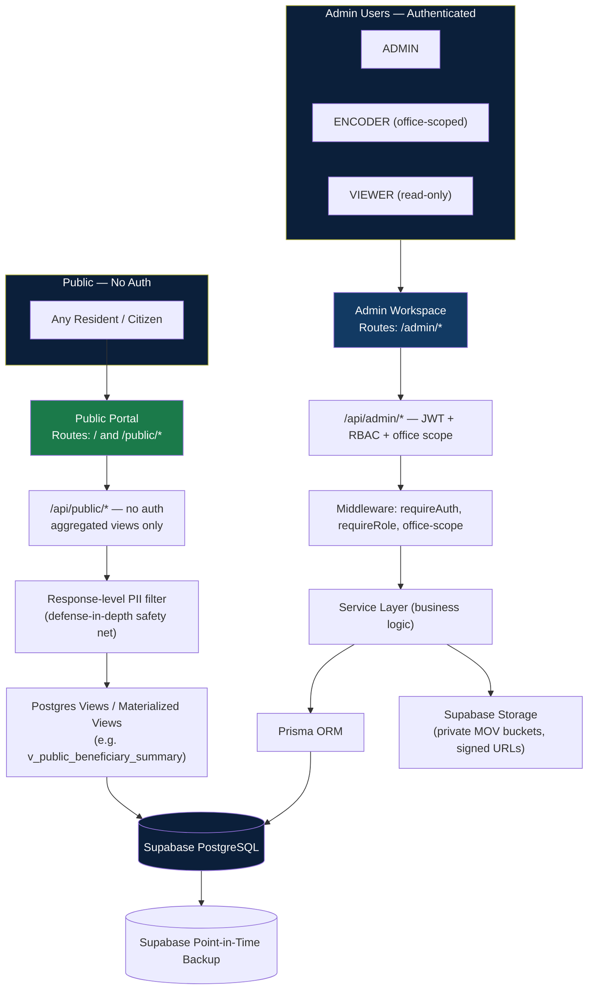
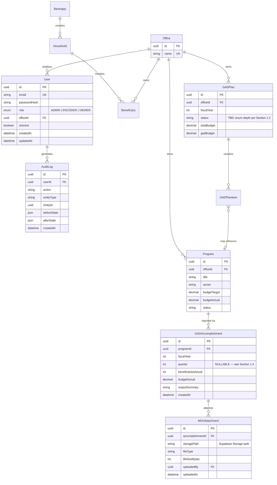
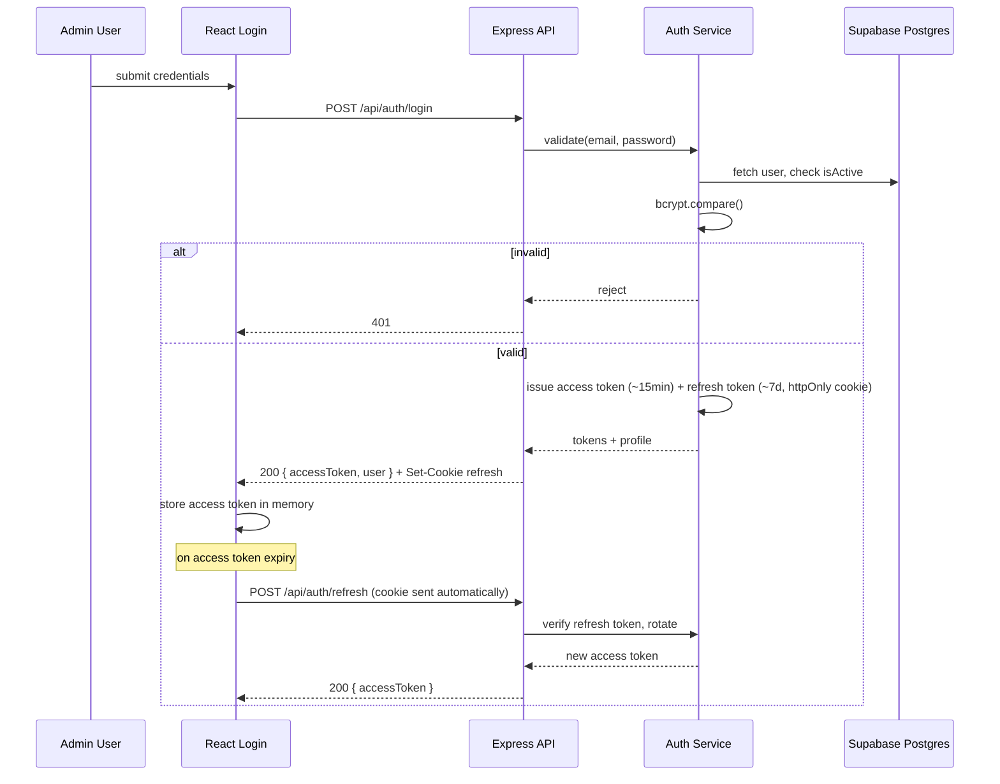
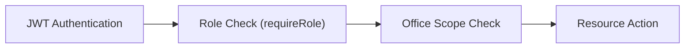
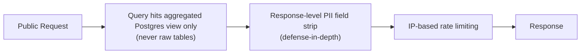
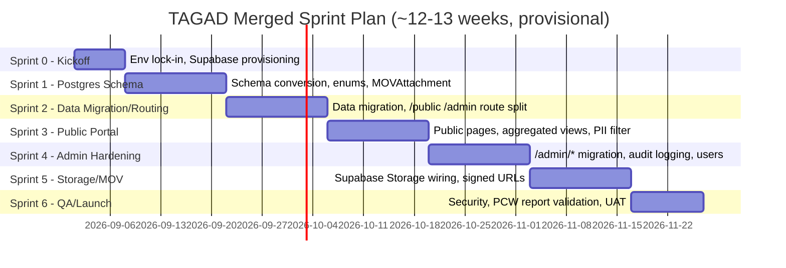

# TAGAD SYSTEM — MASTER ENGINEERING BLUEPRINT v2
### Talibon Analytics for Gender and Development
**Merged Reference: Original Engineering Blueprint + Public/Admin Transparency Platform Plan**

Prepared for: Tech Lead, TAGAD Project
Status: Merged draft — **contains open scope questions that need your decision before Sprint 1 starts** (Section 1)
Legend: 🟢 Confirmed in both documents · 🟡 Needs decision/confirmation · 🔴 Hardening not yet implemented · ⚠️ **Conflict between the two source documents — flagged, not resolved**

---

## 1. RECONCILIATION SUMMARY — READ THIS FIRST

The original Master Blueprint and the new Project Plan describe **compatible architectures at the engineering-discipline level** (layered backend, RBAC, audit logging, Prisma/Postgres) but **disagree on scope and role model** in ways that materially affect the sprint plan and possibly the quotation. This document merges what's compatible and calls out what isn't. Nothing below silently picks a side on the ⚠️ items — those need your call.

<table class="recontable">
<thead><tr><th>Topic</th><th>Original Blueprint</th><th>New Project Plan</th><th>Status</th></tr></thead>
<tbody>
<tr><td><b>Public-facing portal</b></td><td>Not present — admin-only system</td><td>Core new feature — unauthenticated <code>/</code> and <code>/public/*</code> with PII-safe aggregated views</td><td>🟢 New scope, adopted below</td></tr>
<tr><td><b>Roles</b></td><td>6 roles: ADMIN, PLANNER, GAD FOCAL, OFFICE HEAD, ENCODER, VIEWER</td><td>3 roles: ADMIN, ENCODER, VIEWER</td><td>⚠️ see 1.1</td></tr>
<tr><td><b>GPB approval workflow</b></td><td>Full state machine: DRAFT→SUBMITTED→UNDER_REVIEW→RETURNED→RESUBMITTED→ENDORSED→APPROVED, with GAD Focal/MPDC/Mayor actors</td><td><code>/api/admin/gad-plans</code> is generic CRUD; <code>GADPlanStatus</code> enum mentioned but no transition endpoints/actors</td><td>⚠️ see 1.2</td></tr>
<tr><td><b>HGDG scoring/attribution</b></td><td>Dedicated Sprint 4, isolated scoring service</td><td>Not mentioned anywhere</td><td>⚠️ see 1.3</td></tr>
<tr><td><b>GAR (quarterly + variance)</b></td><td>Dedicated Sprint 5: Target vs Actual vs Variance per quarter, MOV per quarter</td><td>Simpler <code>Program</code> + <code>GADAccomplishment</code>; no quarterly/variance structure</td><td>⚠️ see 1.4</td></tr>
<tr><td><b>5% GAD budget threshold</b></td><td>Dedicated calculation service, PCW-relevant</td><td>Not mentioned</td><td>⚠️ see 1.5</td></tr>
<tr><td><b>Bulk Excel/CSV import</b></td><td>Entire Sprint 2 (import, mapping, dedup, rollback)</td><td>Only singular <code>POST /api/admin/beneficiaries</code></td><td>⚠️ see 1.6</td></tr>
<tr><td><b>GIS / 34-barangay map</b></td><td>Dedicated Sprint 7</td><td>Public portal has "demographics viewer" only, no map</td><td>⚠️ see 1.7</td></tr>
<tr><td><b>Database engine</b></td><td>SQLite (dev) → PostgreSQL (prod), host TBD</td><td>Supabase (Postgres + Storage) for both</td><td>🟢 adopted below</td></tr>
<tr><td><b>MOV file storage</b></td><td>Generic "MOV/file storage," flagged as hardening item</td><td>Concrete: Supabase Storage, private buckets, signed URLs</td><td>🟢 more specific, adopted</td></tr>
<tr><td><b>Audit logging</b></td><td>Every sensitive mutation, same-transaction write</td><td>Same principle, same fields</td><td>🟢 Consistent</td></tr>
<tr><td><b>Office scoping</b></td><td>Core authorization dimension</td><td>Same principle, still applies to ENCODER</td><td>🟢 Consistent</td></tr>
<tr><td><b>Reporting (PCW PDF/Excel)</b></td><td>Dedicated Sprint 6, golden-dataset regression testing</td><td><code>export-pdf</code>/<code>export-excel</code>, validated in final sprint</td><td>🟢 merged below</td></tr>
<tr><td><b>Timeline</b></td><td>16 weeks / 8 sprints</td><td>~12–13 weeks / 7 sprints (Sprint 0–6)</td><td>⚠️ see 1.8</td></tr>
<tr><td><b>Quotation (₱330,000)</b></td><td>7 phases roughly map to original 8-sprint scope</td><td>Drops several priced-in features, adds new ones</td><td>⚠️ see 1.9</td></tr>
</tbody>
</table>

### 1.1 — Role model conflict
The new plan's 3-role model has no seat for **PLANNER** (who owns GPB drafting), **GAD FOCAL** (who reviews/endorses GPB and owns cross-office GAD visibility), or **OFFICE HEAD** (who authorizes on behalf of an office and submits GPB/GAR). If the approval workflow in 1.2 is being simplified or cut, this role reduction is consistent and fine. If the full GPB approval chain is still required, the 3-role model can't express "GAD Focal reviews, Mayor approves" as distinct steps — everything would collapse into ADMIN doing all of it, which defeats the separation-of-duties purpose the original workflow was designed for.
**Decision needed:** confirm whether PLANNER/GAD FOCAL/OFFICE HEAD are (a) intentionally folded into ADMIN for this phase, (b) deferred to a later release, or (c) an oversight in the new plan that should be added back.

### 1.2 — GPB approval workflow conflict
Related to 1.1. The new plan's `GADPlanStatus` enum implies *some* status field exists, but no submit/review/endorse/approve endpoints appear in the API spec — only generic `GET/POST /api/admin/gad-plans` and `PUT/DELETE`. **Decision needed:** is GPB, for this release, just a document with a status label (e.g. Draft/Published) rather than a multi-actor approval chain? If yes, this is a real scope reduction from the original blueprint and should be reflected in the quotation. If no, the workflow from the original blueprint (Section 13 there) needs to be added back into this plan's API and sprint plan.

### 1.3 — HGDG conflict
HGDG (Harmonized Gender and Development Guidelines scoring, which feeds attributed budget into GPB line items) is a PCW-relevant compliance feature in the original blueprint and is completely absent from the new plan. **Decision needed:** is HGDG out of scope for this phase, or missing by omission? If TAGAD needs to produce PCW-compliant HGDG-scored budget attribution, it has to be scheduled somewhere — it isn't currently.

### 1.4 — GAR / quarterly variance conflict
The original GAR model tracks Target vs. Actual vs. Variance per quarter (Q1–Q4) against approved GPB line items, each with its own MOV and explanation for variance. The new plan's `GADAccomplishment` + `MOVAttachment` model reads as a flatter, non-quarterly structure. **Decision needed:** does GADAccomplishment need a `quarter` field and variance tracking, or is quarter-level detail not required for this phase (e.g., annual reporting only)?

### 1.5 — 5% GAD budget threshold conflict
Not mentioned in the new plan at all. This is a specific PCW statutory compliance check (GAD budget must be ≥5% of total appropriations). **Decision needed:** in or out of scope for this phase?

### 1.6 — Bulk import conflict
The original blueprint treats bulk Excel/CSV beneficiary import (with column mapping, dedup, transactional rollback) as a full 2-week sprint. The new plan's API only lists a singular `POST /api/admin/beneficiaries`. **Decision needed:** if the LGU has an existing spreadsheet of beneficiaries that needs to be loaded once, does that happen via a one-time migration script (lighter weight, no reusable UI) instead of a full import feature? That would explain the omission without it being a gap — but it should be an explicit decision, not an assumption.

### 1.7 — GIS conflict
34-barangay interactive map is a full sprint in the original blueprint; the new plan's public portal only mentions a "demographics viewer." **Decision needed:** is the interactive map deferred, replaced by simpler charts, or still required but just missing from this plan's sprint list?

### 1.8 — Timeline conflict
Original: 16 weeks. New: ~12–13 weeks. Given items 1.1–1.7 represent real feature reduction (fewer roles, simpler GPB, no HGDG, no quarterly GAR, no bulk import UI, no GIS), a shorter timeline is *plausible* — but only if those cuts are intentional. If any of 1.1–1.7 come back into scope, the 12–13 week estimate in Section 5 of the new plan will need to grow accordingly. This blueprint's sprint plan (Section 9 below) is built on the new plan's timeline; treat it as provisional until 1.1–1.7 are resolved.

### 1.9 — Quotation conflict
The ₱330,000 quotation was structured around 7 generic phases that could plausibly absorb either scope. If the new plan is the final scope (public portal + simplified admin, no HGDG/GIS/bulk-import/full-GPB-workflow), the quotation's Phase 3 (Core System, ₱75,000) and Phase 4 (CMS, ₱45,000) descriptions should be re-checked against what's actually being built — CMS in the original quotation implied general content management, which now maps reasonably well to the public portal's published-content needs, but it's worth an explicit re-confirmation with whoever holds the commercial relationship rather than assuming the original number still fits.

**Recommendation:** resolve 1.1–1.7 with the LGU/stakeholder before Sprint 1 begins. Section 9 (Sprint Plan) below proceeds on the new plan's leaner scope as the working assumption, with each dropped feature listed as a clearly-labeled backlog item in Section 10 so it isn't lost if it comes back into scope.

---

## 2. EXECUTIVE OVERVIEW (MERGED)

TAGAD is now a **two-sided system**: a public, unauthenticated transparency portal and a secured admin workspace, both backed by a single Supabase PostgreSQL instance. This supersedes the original admin-only architecture while keeping its engineering discipline intact:

- **Backend is the sole security boundary** on the admin side; the **public side has no auth at all by design** — its safety comes from querying PII-free aggregated views, not from access control.
- **Office scoping** still applies to ENCODER writes.
- **Auditability by design** — every admin-side mutation writes an AuditLog row in the same transaction.
- **Server-side aggregation** for both the admin dashboard and the new public dashboard — the public API must never expose row-level data, enforced at the query layer (dedicated views) plus a response-level PII-stripping safety net.

---

## 3. SYSTEM CONTEXT DIAGRAM (UPDATED — TWO-SIDED)

**Legend:** Green = public/unauthenticated tier · Navy = authenticated admin tier · Dark navy = data/storage tier.

---

## 4. ROLE MODEL — AS ADOPTED FOR THIS PLAN (pending Section 1.1 resolution)

| Role | Scope | Notes |
|---|---|---|
| `ADMIN` | All offices, all resources | Full CRUD, user management, role assignment, audit log access — also absorbs GAD-Focal-equivalent and Mayor-equivalent authority under the current 3-role model |
| `ENCODER` | Own office only | CRUD on Beneficiaries/Programs/GAD Plans/Accomplishments for their assigned office |
| `VIEWER` | Read-only, scope TBD | Read access to admin dashboards and reports; no writes |

⚠️ This table reflects the new plan **as written**. If Section 1.1 resolves toward keeping PLANNER/GAD FOCAL/OFFICE HEAD, this table and the permission matrix below must be rebuilt to match the original blueprint's 6-role matrix instead.

### Permission Matrix (3-role model, as currently scoped)

| Action | ADMIN | ENCODER | VIEWER |
|---|---|---|---|
| View (own office) | Yes | Yes | Yes |
| View (all offices) | Yes | No | 🟡 TBD |
| Create/Edit (own office) | Yes | Yes | No |
| Delete/Archive | Yes | 🟡 TBD (own office?) | No |
| Upload MOV | Yes | Yes | No |
| Download MOV | Yes | Yes | Yes |
| Export PDF/Excel | Yes | Yes | Yes |
| Manage Users | Yes | No | No |
| View Audit Logs | Yes | No | No |

---

## 5. DATABASE ERD (MERGED — reconciles original entity names with new plan's entities)

**Naming reconciliation applied:** `GAR` (original) → `GADAccomplishment` (new plan's term, adopted). `MOV` (original) → `MOVAttachment` (new plan's term, adopted, now explicitly linked to Supabase Storage paths rather than a generic file table). A new `Program` entity is introduced by the new plan as the parent of accomplishments — this didn't exist in the original ERD, where accomplishments hung directly off `GADPlanItem`. **This is itself a modeling question worth confirming:** should `Program` supersede `GADPlanItem`, or should both exist (Program = the operational thing being done, GADPlanItem = its budget line in the GPB)? The ERD above assumes the latter (a loose optional link), but this needs explicit sign-off — it's a schema decision, not just a naming one.

`HGDGAssessment`, `GARQuarter`, and `ReviewComment` from the original ERD are **omitted here pending Section 1.2/1.3/1.4** — add them back if those workflows are confirmed in scope.

---

## 6. API ARCHITECTURE (MERGED — public + admin, from the new plan, annotated)

### 6.1 Auth API
| Method & Path | Access | Notes |
|---|---|---|
| `POST /api/auth/login` | Public (credentials) | Issues access token (~15 min) + httpOnly refresh cookie (~7 days) — 🟢 more concrete than the original blueprint's undefined token lifetime |
| `POST /api/auth/refresh` | Refresh cookie | Rotates access token |
| `POST /api/auth/logout` | Authenticated | Invalidates refresh token — 🟢 resolves the original blueprint's 🔴 "no logout/session invalidation" hardening gap |
| `GET /api/auth/me` | Authenticated | Current user profile + role + office |

### 6.2 Public API — `/api/public/*` (no auth, aggregated only)
| Method & Path | Description |
|---|---|
| `GET /api/public/dashboard` | Municipal-wide KPIs (aggregated) |
| `GET /api/public/demographics` | Sex/age/sector breakdowns by barangay, counts only |
| `GET /api/public/programs` | Published programs: title, description, office, sector, budget vs actual, status |
| `GET /api/public/accomplishments` | Published accomplishment summaries, aggregate counts |
| `GET /api/public/gad-plans` | Published/approved GAD plan matrix, non-sensitive fields only |
| `POST /api/public/feedback` | Citizen feedback, rate-limited, spam-checked |

Every one of these must be verified, per-endpoint, against the PII field list (full name, birthdate, exact address, contact number, national ID) as part of Definition of Done — see Section 11.

### 6.3 Admin API — `/api/admin/*` (JWT + role required)
Full table carried over from the new plan (Section 4.3 of that document) — reproduced here for a single source of truth:

| Method & Path | Roles | Description |
|---|---|---|
| `GET/POST /api/admin/beneficiaries` | ADMIN, ENCODER, VIEWER(read) | List/create, filters, pagination |
| `PUT/DELETE /api/admin/beneficiaries/:id` | ADMIN, ENCODER(own office) | Update/archive |
| `GET /api/admin/beneficiaries/export` | ADMIN, ENCODER, VIEWER | Excel export |
| `GET/POST /api/admin/programs` | ADMIN, ENCODER, VIEWER(read) | Program CRUD |
| `PUT/DELETE /api/admin/programs/:id` | ADMIN, ENCODER(own office) | Update/delete |
| `GET/POST /api/admin/gad-plans` | ADMIN, ENCODER, VIEWER(read) | ⚠️ Generic CRUD only — no submit/review/approve; see Section 1.2 |
| `PUT/DELETE /api/admin/gad-plans/:id` | ADMIN, ENCODER(own office) | Update/delete |
| `GET/POST /api/admin/accomplishments` | ADMIN, ENCODER, VIEWER(read) | Against approved plans/programs |
| `PUT/DELETE /api/admin/accomplishments/:id` | ADMIN, ENCODER(own office) | Update/delete |
| `POST /api/admin/accomplishments/:id/mov` | ADMIN, ENCODER | Upload MOV to Supabase Storage |
| `GET /api/admin/accomplishments/:id/mov/:fileId` | ADMIN, ENCODER, VIEWER | Signed-URL download |
| `GET /api/admin/reports/export-pdf` | ADMIN, VIEWER | Statutory PCW PDF |
| `GET /api/admin/reports/export-excel` | ADMIN, VIEWER | Statutory PCW Excel |
| `GET/POST /api/admin/users` | ADMIN only | User management |
| `PUT/DELETE /api/admin/users/:id` | ADMIN only | Role/office edit, deactivate, password reset |
| `GET /api/admin/dashboard/stats` | ADMIN, ENCODER, VIEWER | Internal KPI dashboard |
| `GET /api/admin/audit-logs` | ADMIN only | Audit trail query |

🟡 Missing vs. the original blueprint's endpoint list (add back if Section 1 items are confirmed in scope): `POST /api/beneficiaries/bulk-upload`, `POST /api/gad-plans/:id/submit`, `/review`, `/approve`, `POST /api/hgdg`, GIS/analytics map endpoints.

---

## 7. AUTHENTICATION FLOW (UPDATED — access + refresh token pair)

This resolves two 🔴 hardening gaps flagged in the original blueprint's Security Architecture (Section 10 there): refresh-token rotation and logout/session invalidation are now concretely specified rather than open items.

---

## 8. SECURITY ARCHITECTURE (MERGED)

### 8.1 Admin side — same authorization chain as before

### 8.2 Public side — no auth, PII protection at the query and response layers

### 8.3 Security control status (merged and updated)
| Control | Status |
|---|---|
| Input validation | 🟢 |
| SQL injection protection (Prisma) | 🟢 |
| Refresh-token rotation | 🟢 now specified (Section 7) — was 🔴 in original |
| Logout/session invalidation | 🟢 now specified — was 🔴 in original |
| Public-side PII exposure prevention | 🟢 now specified: view-layer + response-filter — **new requirement, needs automated test coverage (Section 11)** |
| File upload validation (MOV) | 🟢 now concrete: Supabase Storage, private buckets, signed URLs — was 🔴 generic in original |
| Rate limiting | 🟢 specified for public side; 🔴 still unconfirmed for admin-side login (brute-force protection) |
| Secure HTTP headers (Helmet/CSP/HSTS) | 🔴 still not confirmed — carry over from original |
| Password policy | 🟡 still needs LGU confirmation — carry over from original |
| Secrets management | 🔴 still needs verification that `SUPABASE_SERVICE_ROLE_KEY` and DB credentials are never exposed client-side — **new risk specific to Supabase**: the service-role key must only ever be used server-side, never in frontend bundles |
| HTTPS | 🟢 assumed via Supabase + hosting provider |
| Backups | 🟢 Supabase point-in-time recovery (tier-dependent, confirm plan) |

🔴 **New Supabase-specific item not in the original blueprint:** confirm Row Level Security (RLS) posture. Since this architecture routes all admin writes through the Express API (not direct client-to-Supabase calls), RLS is not strictly required for correctness — the API is the security boundary. However, if any future feature calls Supabase directly from the frontend (common in Supabase-native apps), RLS policies become mandatory at that point. Document this decision explicitly so a future contributor doesn't assume RLS is protecting tables it isn't.

---

## 9. SPRINT PLAN (ADOPTS NEW PLAN'S 7-SPRINT TIMELINE — provisional per Section 1.8)

### Sprint 0 — Kickoff & Environment Lock-in (1 week)
- Confirm Supabase project, `.env`, backup existing dev database
- **Resolve Section 1 open items with stakeholders before this sprint closes** — this is the natural checkpoint since nothing downstream should be built against unresolved scope
- Ratify roadmap; backlog written into tracker
- **Exit criteria:** Section 1 conflicts resolved and logged; Supabase reachable; backup archived

### Sprint 1 — PostgreSQL/Supabase Schema Conversion (2 weeks)
- `schema.prisma` provider → `postgresql`, pointed at Supabase
- Native enums: `Role`, `Sex`, `GADPlanStatus` (depth depends on Section 1.2 resolution)
- `MOVAttachment` model added
- Migration history generated and reviewed
- **Exit criteria:** `prisma migrate deploy` clean against Supabase; schema reflects Section 1 resolutions

### Sprint 2 — Data Migration & Route Restructuring (2 weeks)
- Data migration script with row-count validation (existing data → Supabase)
- Backend routes split into `/api/public/*` and `/api/admin/*`
- `requireAuth` / `requireRole` / office-scope middleware implemented
- **Exit criteria:** all data present in Postgres; admin routes reject unauthenticated calls; public routes reachable with no auth

### Sprint 3 — Public Portal Build (2 weeks)
- `/`, `/public-analytics`, `/transparency` pages
- Aggregated-only endpoints backed by Postgres views
- Response-level PII filter as safety net + automated test suite proving zero PII leakage
- **Exit criteria:** public routes verified (automated test) to return zero PII fields across every endpoint

### Sprint 4 — Admin Workspace Hardening (2 weeks)
- Admin UI fully under `/admin/*`
- Audit logging on all CRUD writes
- User management: role assignment, deactivation, password reset
- **Exit criteria:** every CRUD write produces an audit log row; roles enforced end-to-end

### Sprint 5 — Supabase Storage for MOV Evidence (2 weeks)
- File uploads wired to Supabase Storage buckets
- File-type/size validation, private bucket policy, signed-URL downloads
- MOVs linked to `GADAccomplishment` records
- **Exit criteria:** uploaded MOV files retrievable only by authorized roles

### Sprint 6 — QA, Compliance & Launch (1–2 weeks)
- Security pass: auth bypass attempts, public-API PII leakage checks
- PCW report output validated against statutory format
- UAT with municipal stakeholders on both portal and admin sides
- Production deploy + rollback plan
- **Exit criteria:** stakeholder sign-off, no critical/high findings open

---

## 10. BACKLOG — ITEMS FROM THE ORIGINAL BLUEPRINT NOT CURRENTLY SCHEDULED

Kept here explicitly so nothing is silently lost if Section 1's open questions resolve toward keeping them in scope:

- Full GPB multi-actor approval workflow (submit → review → return → endorse → approve) with PLANNER/GAD FOCAL/OFFICE HEAD/Mayor actors
- HGDG questionnaire, scoring, classification, and budget attribution service
- 5% GAD budget threshold validation against total LGU appropriations
- Quarterly (Q1–Q4) accomplishment tracking with Target vs. Actual vs. Variance and per-quarter MOV
- Bulk Excel/CSV beneficiary import with column mapping, preview, dedup, and transactional rollback
- 34-barangay interactive GIS map with beneficiary density, program reach, and underserved-barangay indicators
- Rate limiting / brute-force protection on admin login
- Secure HTTP headers (Helmet/CSP/HSTS)

Each of these has a fully-specified design already written in the original Master Blueprint (v1) — re-adding any of them to scope means pulling the matching section from that document rather than redesigning from scratch.

---

## 11. DEFINITION OF DONE (MERGED, WITH PUBLIC-SIDE ADDITION)

A feature is not done until:
- [ ] Requirements understood (including explicit confirmation it isn't one of the Section 1 conflict items, or that the conflict is resolved)
- [ ] UI implemented
- [ ] API implemented
- [ ] Database changes completed
- [ ] Validation implemented
- [ ] Authorization implemented (admin side) **or** PII-safety verified (public side)
- [ ] **Public-side only:** automated test proves zero PII fields in response payload
- [ ] Error handling implemented
- [ ] Audit logging implemented where applicable (admin side)
- [ ] Unit tests
- [ ] Integration tests
- [ ] E2E test where applicable
- [ ] Code reviewed
- [ ] Security reviewed
- [ ] Documentation updated
- [ ] Demo completed
- [ ] Acceptance criteria passed

---

## 12. RISK REGISTER (MERGED — new risks from the public/admin split highlighted)

| # | Risk | Prob. | Impact | Mitigation |
|---|---|---|---|---|
| 1 | **PII leakage on public portal** (new risk, highest priority in this merged plan) | Med | Critical | View-layer restriction + response-level filter + automated test in every sprint touching `/api/public/*`, per Section 11 |
| 2 | Incorrect office-level authorization (admin side) | Med | High | Middleware test matrix, carried over from original |
| 3 | Scope ambiguity from Section 1 unresolved conflicts | High | High | Resolve before Sprint 1 per Sprint 0 exit criteria |
| 4 | `SUPABASE_SERVICE_ROLE_KEY` accidentally exposed client-side | Low | Critical | Explicit secrets audit in Sprint 1 and Sprint 6; never reference the service-role key in any frontend bundle or public repo |
| 5 | Compliance gap if HGDG/5% threshold/quarterly GAR are required by PCW but dropped from scope | Med | High | Resolve Section 1.3–1.5 with a compliance-aware stakeholder, not just a product owner |
| 6 | Unauthorized MOV file access | Low | High | Signed URLs + private bucket policy, tested in Sprint 5 |
| 7 | Timeline slips back toward 16 weeks if backlog items (Section 10) are reinstated mid-project | Med | Med | Lock scope at Sprint 0 exit; treat any Section 10 item added later as a change request against the timeline, not a free addition |

---

## 13. WHAT THE TECH LEAD MUST DECIDE BEFORE SPRINT 1

This is the actionable summary of Section 1, restated as decisions rather than descriptions:

1. Confirm final role model: 3 roles (as written) or restore the original 6-role GPB approval chain.
2. Confirm GPB workflow depth: simple status field, or full multi-actor state machine.
3. Confirm HGDG: in scope this phase, deferred, or out of scope entirely.
4. Confirm GAR structure: quarterly with variance, or annual/flat as currently modeled.
5. Confirm 5% GAD threshold validation: in or out of scope.
6. Confirm bulk import: full feature, or one-time migration script only.
7. Confirm GIS map: in scope, deferred, or replaced by simpler charts.
8. Once 1–7 are answered, confirm whether the 12–13 week timeline and ₱330,000 quotation still hold, or need revision.

*This document should be updated the moment these decisions are made — treat Section 1 as the changelog until every ⚠️ is resolved to 🟢.*