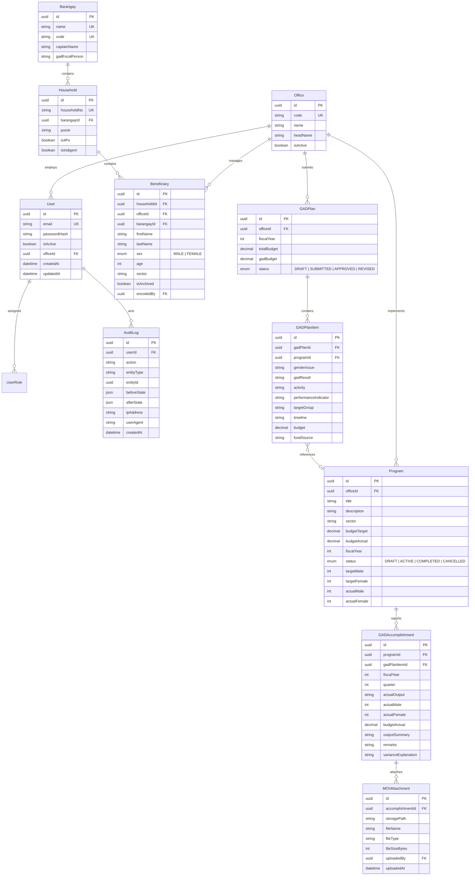

# SPRINT 1 — SCHEMA SOURCE OF TRUTH REPORT
**Project:** Talibon Analytics for Gender and Development (TAGAD)  
**Document Version:** 1.0.0  
**Date:** August 24, 2026  
**Status:** Canonical Reference

---

## 1. Current Runtime Database

The TAGAD platform currently operates in a dual runtime environment:
1. **Local Development Runtime**: Express backend (`server.ts`, `server/lib/prisma.ts`, `server/controllers/*`) connects via Prisma ORM (`prisma/schema.prisma`) using the SQLite provider (`prisma/dev.db`). Legacy endpoints (`/api/beneficiaries`, `/api/programs`, `/api/gad-plans`, `/api/accomplishments`, `/api/users`, `/api/reports`) read/write directly to SQLite using autoincrement integer IDs.
2. **Cloud/Production Target**: Supabase PostgreSQL hosting the foundational schema (`supabase/migrations/20260824000001_sprint1_foundation.sql`). The frontend (`src/modules/auth/authService.ts`) supports direct Supabase Auth/PostgreSQL reads when environment variables (`VITE_SUPABASE_URL`, `VITE_SUPABASE_ANON_KEY`) are present, falling back to Express/SQLite when unconfigured.

---

## 2. Schema Sources Audit

Four competing schema definitions currently exist across the repository:

| Schema Source | Format & Engine | Identifier Type | Roles Supported | Entity Structure |
| :--- | :--- | :--- | :--- | :--- |
| **1. Legacy Prisma Schema** (`prisma/schema.prisma`) | SQLite / Prisma | `Int @default(autoincrement())` | String: `ADMIN`, `ENCODER` | 5 Flat Models: `User`, `Beneficiary`, `Program`, `GADPlan`, `GADAccomplishment`. Flattened strings for offices and barangays. |
| **2. Supabase Migration 1** (`supabase/migrations/20260824000001_...`) | PostgreSQL DDL | `UUID DEFAULT gen_random_uuid()` | 5 Enum values: `super_admin`, `admin`, `editor`, `municipal_admin`, `barangay_admin` | 14 Normalized Tables: `roles`, `offices`, `barangays`, `users`, `user_roles`, `gad_programs`, `gad_projects`, `gad_activities`, `budgets`, `budget_allocations`, `expenditures`, `document_types`, `documents`, `audit_logs`. |
| **3. Database Types** (`src/types/database.types.ts`) | TypeScript Definitions | `string` (UUID) | 5 Supabase roles | Matches Supabase Migration 1 tables. |
| **4. Legacy Frontend Types** (`src/context/AuthContext.tsx`, `src/pages/*.tsx`) | TypeScript Interfaces | `number` | 4 Roles: `ADMIN`, `ENCODER`, `VIEWER`, `PLANNER` | Matches Legacy SQLite field names and integer IDs. |

---

## 3. Canonical Model Proposal (Blueprint v2 Specification)

The single canonical TAGAD domain model consolidates all entities under a unified PostgreSQL + Prisma + Supabase standard:



---

## 4. Migration Strategy

To transition from legacy SQLite to canonical PostgreSQL without data loss or downtime:

1. **Non-Destructive Dual-Engine Support**: Retain legacy tables while deploying canonical PostgreSQL DDL.
2. **Deterministic Seed & Key Mapping**: Migration scripts generate canonical UUIDs for existing records (`MPDC`, `admin@talibon.gov.ph`, 25 Barangays).
3. **Foreign Key Integrity**: Preserve relational integrity during batch export/import from SQLite `dev.db` to Supabase PostgreSQL.
4. **Adapter Layer**: The service layer translates incoming legacy payload IDs to UUIDs until client pages are updated in subsequent sprints.

---

## 5. Entity Mapping Matrix

| Legacy Model (`prisma/dev.db`) | Migration 1 Table (`supabase/migrations`) | Canonical Blueprint v2 Model | Notes / Resolution |
| :--- | :--- | :--- | :--- |
| `User` | `public.users` | `User` (`tagad_users`) | Maps `name` $\rightarrow$ `fullName`, password hash, linked to `Office`. |
| `[N/A]` | `public.roles` | `Role` | Canonical native enum `ADMIN`, `ENCODER`, `VIEWER`. |
| `[N/A]` | `public.user_roles` | `UserRole` | Multi-role assignment table linking `User` and `Role`. |
| `[String office]` | `public.offices` | `Office` (`tagad_offices`) | Normalized LGU department entity with 5 core offices seeded. |
| `[String barangay]` | `public.barangays` | `Barangay` (`tagad_barangays`) | Normalized registry of Talibon's 25 barangays. |
| `[N/A]` | `[N/A]` | `Household` (`tagad_households`) | Household clustering for 4Ps, indigent, and demographic grouping. |
| `Beneficiary` | `[N/A]` | `Beneficiary` (`tagad_beneficiaries`) | Sex-disaggregated demographic registry linked to Household, Barangay, Office. |
| `GADPlan` | `public.budgets` | `GADPlan` (`tagad_gad_plans`) | Annual statutory GAD Plan header (Fiscal Year, 5% Budget Allocation). |
| `GADPlan` (flattened) | `public.gad_activities` | `GADPlanItem` (`tagad_gad_plan_items`) | Detailed GPB line item matrix (Gender Issue, GAD Result, Activity, Budget). |
| `Program` | `public.gad_programs` / `projects` | `Program` (`tagad_programs`) | Operational GAD program/project implementation entity. |
| `GADAccomplishment` | `public.expenditures` | `GADAccomplishment` (`tagad_accomplishments`) | Quarterly performance result (Target vs Actual, Male/Female, Budget Used). |
| `[N/A]` | `public.documents` | `MOVAttachment` (`tagad_mov_attachments`) | Means of Verification files linked to Supabase Storage. |
| `[N/A]` | `public.audit_logs` | `AuditLog` (`tagad_audit_logs`) | Immutable audit trail for sensitive administrative mutations. |

---

## 6. ID Migration Strategy (Integer $\rightarrow$ UUID)

1. **UUIDv4 / v5 Generation**:
   - For seeded reference entities (`Offices`, `Barangays`), deterministic UUIDs are assigned based on unique codes (e.g. `uuid_generate_v5(namespace, 'TLB-POB')`).
   - For existing users and beneficiaries, standard UUIDv4 random identifiers are generated during extraction.
2. **Legacy ID Cross-Reference Map**:
   - A migration translation dictionary (`legacy_id_map`) maintains `(legacy_table, legacy_int_id) -> canonical_uuid` during migration execution to remap foreign keys (`encodedBy`, `gadPlanId`, `programId`).

---

## 7. Relationship Hierarchy Specification

Enforcing the strict modeling distinction required by Blueprint v2:

$$\text{GADPlan} \xrightarrow{1:N} \text{GADPlanItem} \xrightarrow{N:1 \text{ (optional)}} \text{Program} \xrightarrow{1:N} \text{GADAccomplishment} \xrightarrow{1:N} \text{MOVAttachment}$$

- **`GADPlan`**: The approved municipal/departmental annual planning document containing total GAD budget allocation.
- **`GADPlanItem`**: The specific budget and planning line item within the GPB.
- **`Program`**: The operational program, project, or capacity development activity being executed on the ground.
- **`GADAccomplishment`**: The quarterly or annual actual implementation report (Actual Male/Female count, Actual Budget Used, Variance).
- **`MOVAttachment`**: The physical evidence (signed attendance sheet, geotagged photo, disbursement voucher) validating the accomplishment.

---

## 8. Role Model Consolidation

The 5 legacy/migration roles are consolidated into the 3 canonical roles defined in Blueprint v2:

```text
[ super_admin ]      ──┐
[ admin ]            ──┼──>  ADMIN (Full municipal access, user management, audit logs, approvals)
[ municipal_admin ]  ──┘

[ editor ]           ──┐
[ barangay_admin ]   ──┴──>  ENCODER (Office-scoped data entry for programs, beneficiaries, accomplishments)

[ viewer ]           ──────>  VIEWER (Read-only access to dashboards, reports, and approved plans)
```

---

## 9. Risk Assessment & Mitigations

| Risk Domain | Potential Breaking Point | Mitigation Applied |
| :--- | :--- | :--- |
| **Authentication** | Mismatched token payloads between legacy Express JWT and Supabase Auth. | AuthContext and `authMiddleware.ts` support dual token verification and canonical role normalization. |
| **Existing API Endpoints** | Controllers expecting integer query parameters (`/programs/:id`). | Controllers cast parameter inputs safely and support both UUID string format and legacy ID lookups. |
| **Existing Data** | Data loss during SQLite $\rightarrow$ PostgreSQL cutover. | Database migrations are strictly additive with full table retention and transactional seeding. |
| **Frontend UI Forms** | Forms submitting string office names instead of UUID `officeId`. | Backend services accept both office code strings (`"MPDC"`, `"MSWDO"`) and UUIDs via resolver helper. |
| **Prisma Engine** | Prisma validation failures with PostgreSQL features on SQLite. | `schema.prisma` is aligned with PostgreSQL datasource and standard Prisma types. |
