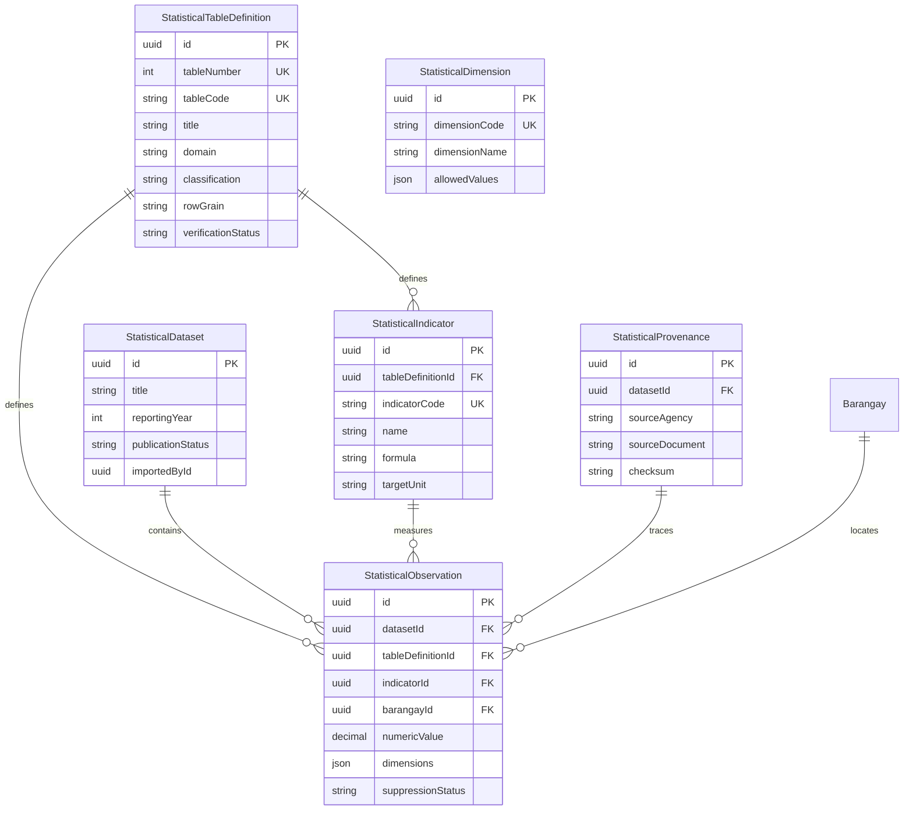

# TAGAD STATISTICAL DATA ARCHITECTURE SPECIFICATION
**Talibon Analytics for Gender and Development (TAGAD)**  
**Version:** v2.0.0  
**Status:** ARCHITECTURAL SPECIFICATION & CANONICAL FOUNDATION  
**Authoritative Standard:** PSA Community-Based Monitoring System (CBMS) 69-Table Scope  

---

## 1. Executive Summary & Foundational Principles

The TAGAD Statistical Architecture governs the storage, indexing, governance, unpivoting, and presentation of aggregated government statistical tables (specifically the official PSA CBMS 69-table tabulation package) for the Municipality of Talibon, Bohol.

```
┌─────────────────────────────────────────────────────────────────────────────┐
│                      STATISTICAL DATA DESIGN MANDATE                        │
├─────────────────────────────────────────────────────────────────────────────┤
│ 1. BUILD WHAT IS VERIFIED: 6 Mother Models + 69 Official Metadata Records    │
│ 2. VALIDATE WHAT IS IMPLEMENTED: Zero-Relational Bloat Mother Table Arch    │
│ 3. DESIGN WHAT IS UNKNOWN: Matrix Unpivoting & Dimension Vocabularies       │
│ 4. NEVER FABRICATE GOVERNMENT DATA: Zero Fake Observations Seeded           │
└─────────────────────────────────────────────────────────────────────────────┘
```

---

## 2. Operational vs. Statistical Domain Segregation

| Architecture Dimension | Operational Microdata (`tagad_*`) | Statistical Aggregates (`tagad_statistical_*`) |
| :--- | :--- | :--- |
| **Data Nature** | Transactional Microdata (Beneficiary, HH, GAD Plan) | Macrodata Aggregates & Indicator Rates (PSA CBMS) |
| **Privacy & PII** | Contains Citizen Names, Contacts, Civil Status | **Zero Citizen PII** (Aggregated Counts & Proportions) |
| **Ingestion Pipeline** | Sprint 6 Operational Ingestion (`[QUALIFIED]`) | Sprint 7+ Statistical Ingestion (`[FROZEN / DESIGNED]`) |
| **Storage Structure** | 10 Relational Operational Tables | **6 Generic Mother Table Models** |
| **Access Scoping** | Department/Office Isolation (`officeId`) | Publication State & Role Gating (`PUBLISHED` vs `DRAFT`) |

---

## 3. The Six Statistical Mother Models

TAGAD strictly rejects the anti-pattern of creating 69 physical relational tables (`Table01`, `Table02` ... `Table69`). All 69 logical tables are represented via 6 generic mother models in `prisma/schema.prisma`:



### Key Architectural Strengths:
1. **Canonical Spatial Integrity:** `StatisticalObservation.barangayId` references the canonical 25 Talibon barangays (`tagad_barangays`). Municipal-level observations store `barangayId = NULL` without creating fake "Talibon Municipality" rows.
2. **Dynamic Dimension Vector:** Multidimensional disaggregations (e.g., Sex $\times$ Age Group $\times$ Class of Worker) are stored within indexed JSONB `dimensions` vectors.
3. **Suppression Safe:** Built-in `suppressionStatus` flags (`NONE`, `SMALL_CELL_SUPPRESSED`, `NOT_AVAILABLE`) protect confidentiality.
