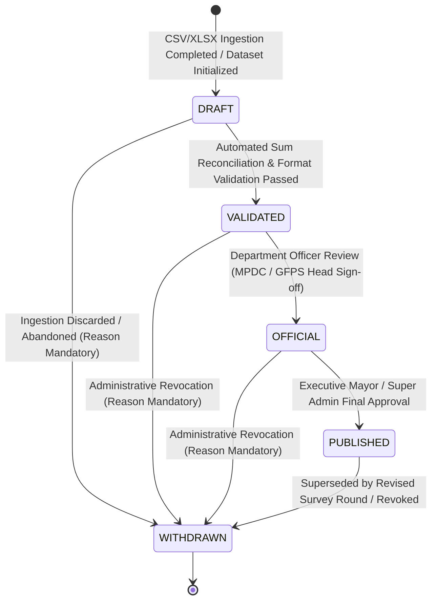
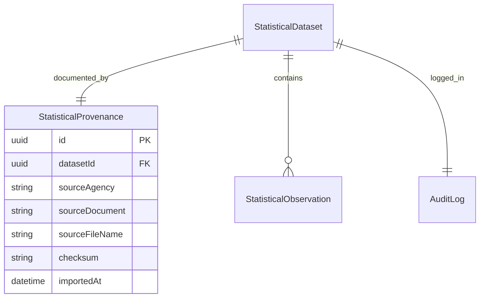

# TAGAD STATISTICAL DATA GOVERNANCE, PRIVACY & LIFECYCLE SPECIFICATION
**System:** Talibon Analytics for Gender and Development (TAGAD)  
**Version:** `v2.0.0`  
**Status:** `[VERIFIED IMPLEMENTATION — SPRINT 7 PHASE 4 COMPLETE]`  
**Legal & Governance Standards:** Data Privacy Act of 2012 (RA 10173), Magna Carta of Women (RA 9710), PSA CBMS Governance Framework  

---

## 1. Dataset Publication Lifecycle & State Machine

Every statistical dataset in TAGAD transitions through a strict 5-stage lifecycle state machine enforced by `StatisticalDatasetService.canTransition()`:

### State Transition Authority Matrix (Implemented & Verified):

| Current State | Target State | Permitted Roles | Required Preconditions | Audit Action | Endpoint |
| :--- | :--- | :--- | :--- | :--- | :--- |
| `[NONE]` | `DRAFT` | `ENCODER`, `ADMIN`, `SUPER_ADMIN` | Valid metadata, uniqueness check | `STATISTICAL_DATASET_CREATED` | `POST /api/admin/datasets` |
| `DRAFT` | `VALIDATED` | `ADMIN`, `SUPER_ADMIN` | Sum reconciliation & schema conformity pass | `STATISTICAL_DATASET_VALIDATED` | `POST /api/admin/datasets/:id/validate` |
| `VALIDATED` | `OFFICIAL` | `ADMIN`, `SUPER_ADMIN` | Department endorsement & MOV metadata | `STATISTICAL_DATASET_OFFICIALIZED` | `POST /api/admin/datasets/:id/official` |
| `OFFICIAL` | `PUBLISHED` | `SUPER_ADMIN` | Executive sign-off authority | `STATISTICAL_DATASET_PUBLISHED` | `POST /api/admin/datasets/:id/publish` |
| `ANY` (except `WITHDRAWN`) | `WITHDRAWN` | `ADMIN`, `SUPER_ADMIN` | Documented revocation reason ($\ge 3$ characters) | `STATISTICAL_DATASET_WITHDRAWN` | `POST /api/admin/datasets/:id/withdraw` |

### State Transition Invariant Rules:
1. **No Skip-Forward Transitions:** `DRAFT` cannot directly transition to `OFFICIAL` or `PUBLISHED`.
2. **No Backward Regression:** `VALIDATED` or `OFFICIAL` cannot regress to `DRAFT`.
3. **Terminal State Lockout:** Once in `WITHDRAWN` state, a dataset cannot be transitioned to any other state.
4. **Server-Side Office Scope Enforcement:** Encoders can only access and create datasets within their assigned office boundary. Admin/Super Admin retain municipal-wide scope.

---

## 2. Privacy & Data Protection Officer (DPO) Safeguards

Even with official LGU processing authority, TAGAD enforces strict **Data Privacy Principles**:

1. **Zero Citizen PII in Statistical Layer (`[VERIFIED]`):** The `StatisticalObservation` mother model stores ONLY aggregated numeric metrics (`Decimal(18,4)`) and categorical dimension tags (`JSONB`). No citizen names, contact numbers, or street addresses exist in the statistical domain.
2. **Public API Shield (`[VERIFIED]`):** Public endpoints (`/api/public/datasets`, `/api/public/demographics`, public dashboards) query **ONLY datasets with `publicationStatus = 'PUBLISHED'`**. Draft, Validated, or Withdrawn datasets are mathematically quarantined from public view.
3. **Small-Cell Suppression Safeguard (`[DESIGNED]`):** Cells with small counts ($n < 3$ or $n < 5$, pending LGU/PSA confirmation) are flagged with `suppressionStatus = "SMALL_CELL_SUPPRESSED"` to prevent deductive disclosure of individual identities in small barangays.

---

## 3. Provenance & Audit Ledger Immutability

Every published statistical observation links deterministically to an immutable provenance ledger:

* **SHA-256 Checksumming:** Uploaded source files are cryptographically hashed upon receipt.
* **Atomic Audit Trail:** All state transitions execute inside PostgreSQL transactions (`prisma.$transaction`) generating non-repudiable audit events in `tagad_audit_logs` storing before/after state snapshots.
* **Audit History Inspection:** `GET /api/admin/datasets/:id/history` retrieves the full chronological audit ledger for departmental review.
