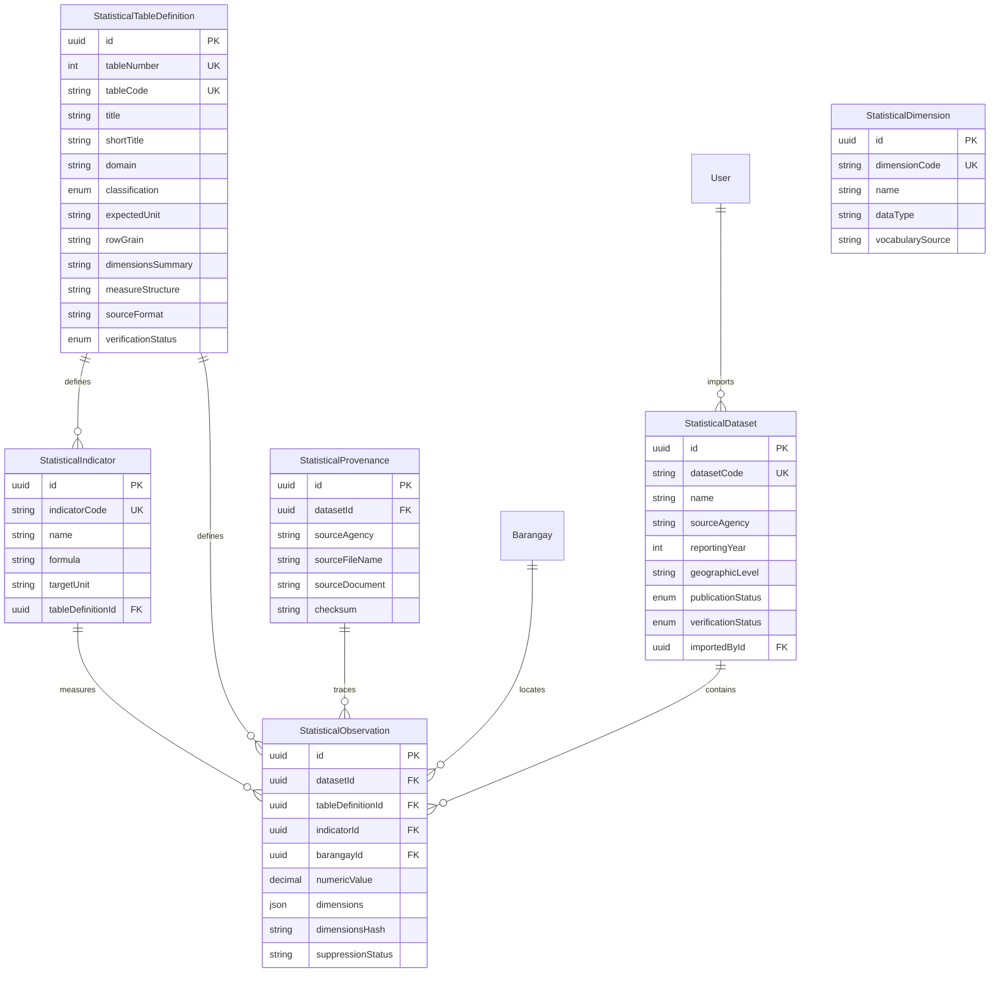

# TAGAD STATISTICAL DOMAIN — FINAL ARCHITECTURE SPECIFICATION
**System:** Talibon Analytics for Gender and Development (TAGAD)  
**Version:** `v2.0.0`  
**Standard:** PSA Community-Based Monitoring System (CBMS) 69-Table Tabulation Scope  
**Status:** `[CANONICAL SPECIFICATION — LOCKED BASELINE]`  
**Engineering Directive:** BUILD WHAT IS VERIFIED • VALIDATE WHAT IS IMPLEMENTED • DESIGN WHAT IS UNKNOWN • NEVER FABRICATE GOVERNMENT DATA  

---

## 1. Executive Architecture Summary

The TAGAD Statistical Architecture governs the storage, indexing, governance, unpivoting, validation, and presentation of aggregated government statistical tables for the Municipality of Talibon, Bohol.

```
┌────────────────────────────────────────────────────────────────────────────────────────┐
│                          STATISTICAL CORE ARCHITECTURE                                 │
├────────────────────────────────────────────────────────────────────────────────────────┤
│ 1. Zero Relational Bloat: 6 Generic Mother Models support all 69 PSA Tabulations.      │
│ 2. Microdata vs. Macrodata Isolation: Operational (PII) and Statistical (Aggregates)   │
│    are strictly separated in storage, services, and API boundaries.                    │
│ 3. Canonical Spatial Anchoring: Observations resolve to the 25 Talibon barangays;      │
│    Municipal totals store NULL barangayId without synthetic municipality rows.         │
│ 4. Matrix Unpivoting Pipeline: 2D/3D cross-tab matrix cells transform to 1D facts.     │
│ 5. Publication Gating: Public portal consumes ONLY datasets marked as PUBLISHED.        │
└────────────────────────────────────────────────────────────────────────────────────────┘
```

---

## 2. Operational Microdata vs. Statistical Macrodata Segregation

| Architecture Dimension | Operational Microdata (`tagad_beneficiaries`, `tagad_households`) | Statistical Macrodata (`tagad_statistical_*`) |
| :--- | :--- | :--- |
| **Data Nature** | Transactional Microdata (Citizen Records, GAD Plans, MOVs) | Aggregated Macrodata (Cross-tabs, Counts, Proportions, Rates) |
| **Privacy & PII** | Contains Citizen Names, Contact Numbers, Street Addresses | **Strictly Zero PII** (Aggregated Counts & Rates only) |
| **Ingestion Pipeline** | Operational CSV Ingestion (Sprint 6 `[VERIFIED]`) | Statistical Matrix Unpivoting Engine (`[DESIGNED / FROZEN]`) |
| **Storage Structure** | Relational Entities per Domain Object | **6 Generic Mother Table Models** |
| **Access Scoping** | Office Scoping (`officeId`) + Department RBAC | Publication Lifecycle State (`DRAFT` $\to$ `PUBLISHED`) |
| **Public API** | Privacy Sanitizer Middleware (PII stripped) | Public Query Gateway (Only `PUBLISHED` observations visible) |

---

## 3. The Six Statistical Mother Models (Prisma DDL)

TAGAD strictly rejects the anti-pattern of creating 69 physical relational tables (`Table01`, `Table02` ... `Table69`). All 69 logical tables are represented via 6 generic mother models in `backend/prisma/schema.prisma`:



### Key Architectural Strengths:
1. **Canonical Spatial Integrity:** `StatisticalObservation.barangayId` references the canonical 25 Talibon barangays (`tagad_barangays`). Municipal-level observations store `barangayId = NULL` without creating fake "Talibon Municipality" rows.
2. **Dynamic Dimension Vector:** Multidimensional disaggregations (e.g., Sex $\times$ Age Group $\times$ Class of Worker) are stored within indexed JSONB `dimensions` vectors.
3. **Suppression Safe:** Built-in `suppressionStatus` flags (`NONE`, `SMALL_CELL_SUPPRESSED`, `NOT_AVAILABLE`) protect confidentiality.
4. **Deterministic Auditing:** Full provenance lineage linking each observation fact back to the exact source document, survey round, and uploading encoder.
