# TAGAD STATISTICAL IMPORT ARCHITECTURE & MATRIX UNPIVOTER SPECIFICATION
**System:** Talibon Analytics for Gender and Development (TAGAD)  
**Version:** `v2.0.0`  
**Status:** `[CANONICAL SPECIFICATION — ENGINE FROZEN UNTIL AUTHENTIC FILES]`  
**Engineering Directive:** BUILD WHAT IS VERIFIED • VALIDATE WHAT IS IMPLEMENTED • DESIGN WHAT IS UNKNOWN • NEVER FABRICATE GOVERNMENT DATA  

---

## 1. Import Pipeline Overview (8 Structured Stages)

The future statistical ingestion engine operates through an **8-Stage Deterministic Pipeline**:

```mermaid
flowchart TD
    S1["Stage 1: Dataset & Table Target Selection<br/>• Select Table from 69 Catalog<br/>• Set Survey Round (e.g. 2024)<br/>• Select Source Agency (PSA / CBMS)"] --> S2["Stage 2: File Upload & MIME Check<br/>• Max 15MB CSV or XLSX<br/>• UTF-8 / Windows-1252 Decoding"]
    
    S2 --> S3["Stage 3: Multi-Header & Banner Discovery<br/>• Header Row Span Detection (1 to 4 rows)<br/>• Merged Cell Normalization<br/>• Stub / Geographic Column Isolation"]
    
    S3 --> S4["Stage 4: Matrix Unpivoting & Dimension Tuple Mapping<br/>• 2D/3D Cross-tab -> 1D Normalized Fact<br/>• Map Header Hierarchy to Canonical Dimensions<br/>(e.g., Sex, Age Group, Class of Worker)"]
    
    S4 --> S5["Stage 5: Geographic Resolution<br/>• Talibon 25 Barangay Exact & Fuzzy Match<br/>• Municipal Total Detection (barangayId = NULL)<br/>• Non-Talibon Row Rejection"]
    
    S5 --> S6["Stage 6: Statistical Validation & Math Reconciliation<br/>• Decimal(18,4) Numeric Precision<br/>• Row Sums == Total Check (Tolerance: 0.01)<br/>• Small-Cell Suppression Detection"]
    
    S6 --> S7["Stage 7: Validation Preview Grid<br/>• Fact Count, Sample Grid, Discrepancies<br/>• Explicit Encoder Confirmation Checkbox"]
    
    S7 --> S8["Stage 8: Batch Persistence & Provenance Logging<br/>• Chunked Transaction into StatisticalObservation<br/>• Immutable Record in StatisticalProvenance<br/>• Set Dataset Status to DRAFT"]
```



---

## 2. Stage Details & Contract Specifications

### Stage 1: Dataset & Target Identification
* **Input:** `tableCode` (`STAT-TAB-01` to `STAT-TAB-70`), `reportingYear` (`Int`), `sourceAgency` (`VarChar(100)`).
* **Validation:** Table code must exist in `StatisticalTableDefinition`.
* **Output:** Staged `StatisticalDataset` initialized with status `DRAFT`.

### Stage 2: File Ingestion & Decoding
* **Input:** Multipart file stream (`.csv` or `.xlsx`).
* **Validation:** File size $\le 15\text{MB}$. File MIME must be `text/csv`, `text/plain`, or `application/vnd.openxmlformats-officedocument.spreadsheetml.sheet`.
* **Output:** In-memory 2D string matrix (`string[][]`).

### Stage 3: Banner & Multi-Header Discovery
* **Discovery Logic:**
  1. Scan rows 1 through 6 for multi-level headers.
  2. Detect merged column spans (in XLSX) or repeated empty strings (in CSV).
  3. Locate the primary geographic stub column (Barangay name).
* **Failure Behavior:** If no recognized barangay names appear in columns 1–3, abort with `HEADER_DISCOVERY_FAILED`.

### Stage 4: Matrix Unpivoting & Dimension Mapping
* **Unpivoting Engine:**
  Transforms $N \times M$ matrix grid into $N \cdot M$ 1D atomic tuples:
  $$\text{Source Cell}(r, c) \longrightarrow \text{Fact}(\text{Barangay}_r, \text{Value}_{r,c}, \text{Dimensions}_c)$$
* **Dimension JSONB Structure:**
  ```json
  {
    "sex": "Female",
    "age_group": "15-24",
    "labor_status": "Employed"
  }
  ```

### Stage 5: Geographic & Spatial Entity Resolution
* **Resolution Rules:**
  * Exact / Normalized match against the canonical 25 Talibon barangays (`tagad_barangays.id`).
  * "Total", "Talibon", "Municipality of Talibon" $\longrightarrow$ `barangayId = NULL` (Municipal Aggregation).
  * Non-Talibon names (e.g. "Cebu City") $\longrightarrow$ Flag as unrecognized row; trigger validation warning.

### Stage 6: Mathematical Validation & Reconciliation
* **Reconciliation Rules:**
  1. **Disaggregation Sum:** $\sum (\text{Male} + \text{Female}) == \text{Total}$ (Tolerance: $\pm 0.01$).
  2. **Barangay Sum:** $\sum (\text{Barangay Values}) == \text{Municipal Total}$ (Tolerance: $\pm 0.01$).
  3. **Rate / Percentage Range:** $0.00 \le \text{Rate} \le 100.00\%$.
* **Suppression Detection:** Cells marked with `*`, `...`, `n.a.`, or small counts under official threshold are tagged as `suppressionStatus = "SMALL_CELL_SUPPRESSED"`.

### Stage 7: Validation Preview Grid
* **UI Delivery:** Returns preview payload containing total observation count, detected dimensions, summary totals, and reconciliation warnings.
* **Gate:** Requires explicit user acknowledgment (`userConfirmedInUI: true`).

### Stage 8: Transactional Persistence & Provenance
* **Persistence:** Chunked database insert (500 rows/batch) into `StatisticalObservation`.
* **Provenance:** Calculates SHA-256 checksum of uploaded source file; persists metadata into `StatisticalProvenance`.
* **Audit:** Emits `STATISTICAL_DATASET_IMPORTED` event to `tagad_audit_logs`.
