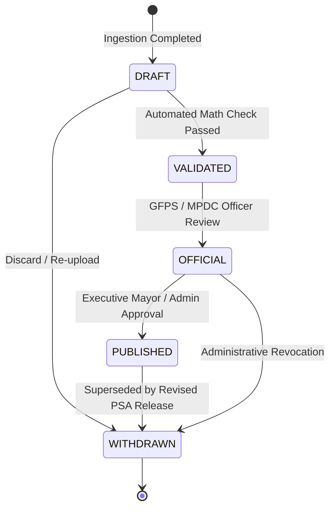

# TAGAD STATISTICAL IMPORT & UNPIVOTING ENGINE SPECIFICATION
**Talibon Analytics for Gender and Development (TAGAD)**  
**Version:** v2.0.0  
**Status:** ARCHITECTURAL SPECIFICATION (ENGINE IMPLEMENTATION FROZEN)  
**Requirement:** Authentic PSA CBMS Physical CSV/XLSX Files Required Before Parser Activation  

---

## 1. End-to-End Import Pipeline

When authentic PSA CBMS raw tabulation files become available, the statistical ingestion wizard will execute through **8 Structured Stages**:

```mermaid
flowchart TD
    S1["1. Table & Dataset Selection<br/>• Select Table from 69 Catalog<br/>• Specify Survey Round / Year (e.g. 2024)<br/>• Select Target Domain"] --> S2["2. File Upload & MIME Inspection<br/>• Max 15MB CSV or XLSX<br/>• UTF-8 / Windows-1252 Decoding"]
    
    S2 --> S3["3. Banner & Multi-Header Discovery<br/>• Header Row Span Detection (1 to 4 rows)<br/>• Merged Cell Normalization<br/>• Stub / Geographic Column Isolation"]
    
    S3 --> S4["4. Matrix Unpivoting & Dimension Mapping<br/>• 2D/3D Cross-tab -> 1D Normalized Fact<br/>• Map Header Hierarchy to Canonical Dimensions<br/>(e.g., Sex, Age Group, Class of Worker)"]
    
    S4 --> S5["5. Geographic & Entity Resolution<br/>• Talibon 25 Barangay Exact & Fuzzy Match<br/>• Municipal Total Detection (barangayId = NULL)<br/>• Non-Talibon Row Rejection"]
    
    S5 --> S6["6. Statistical Validation & Math Reconciliation<br/>• Numeric Precision (Decimal 18,4)<br/>• Row Sums == Total Check (Tolerance: 0.01)<br/>• Small-Cell Suppression Detection"]
    
    S6 --> S7["7. Validation Preview & Encoder Confirmation<br/>• Fact Count, Sample Grid, Discrepancies<br/>• Explicit Encoder Verification Checkbox"]
    
    S7 --> S8["8. Batch Persistence & Provenance Logging<br/>• Chunked Transaction into StatisticalObservation<br/>• Immutable Record in StatisticalProvenance<br/>• Set Dataset Status to DRAFT"]
```



---

## 2. Matrix Unpivoting & Banner Handling Concept

Official PSA tabulations are rarely flat tables. They are 2D cross-tabulations with multi-level headers. The statistical ingestion engine transforms them into 1D atomic facts:

```
PSA 2D Cross-Tabulation Source Format:
┌─────────────────────┬───────────────────────────┬───────────────────────────┐
│                     │           MALE            │          FEMALE           │
│      BARANGAY       ├─────────────┬─────────────┼─────────────┬─────────────┤
│                     │ 15-24 YO    │ 25-60 YO    │ 15-24 YO    │ 25-60 YO    │
├─────────────────────┼─────────────┼─────────────┼─────────────┼─────────────┤
│ San Jose            │     120     │     450     │     115     │     462     │
│ Poblacion           │     340     │     890     │     355     │     910     │
└─────────────────────┴─────────────┴─────────────┴─────────────┴─────────────┘
                                    │
                                    ▼ (Matrix Unpivoting Engine)
TAGAD 1D StatisticalObservation Fact Model:
┌──────────────┬────────────┬─────────────────────────────┬──────────────┐
│  BARANGAY    │  MEASURE   │       DIMENSIONS (JSONB)    │ NUMERIC VALUE│
├──────────────┼────────────┼─────────────────────────────┼──────────────┤
│  San Jose    │ Headcount  │ {"sex":"M", "age":"15-24"}  │    120.00    │
│  San Jose    │ Headcount  │ {"sex":"M", "age":"25-60"}  │    450.00    │
│  San Jose    │ Headcount  │ {"sex":"F", "age":"15-24"}  │    115.00    │
│  San Jose    │ Headcount  │ {"sex":"F", "age":"25-60"}  │    462.00    │
│  Poblacion   │ Headcount  │ {"sex":"M", "age":"15-24"}  │    340.00    │
│  Poblacion   │ Headcount  │ {"sex":"M", "age":"25-60"}  │    890.00    │
│  Poblacion   │ Headcount  │ {"sex":"F", "age":"15-24"}  │    355.00    │
│  Poblacion   │ Headcount  │ {"sex":"F", "age":"25-60"}  │    910.00    │
└──────────────┴────────────┴─────────────────────────────┴──────────────┘
```

---

## 3. Dataset Lifecycle & Publication Governance



* **DRAFT:** Internal staging; visible only to the uploading Encoder and Super Admin.
* **VALIDATED:** Passed all sum reconciliations and geographic validations.
* **OFFICIAL:** Formally signed off by department heads (MPDC/GFPS).
* **PUBLISHED:** Active in public dashboards, GAD plan baseline synchronization, and open-data feeds.
* **WITHDRAWN:** Soft-deleted or archived; historical audit log maintained.
