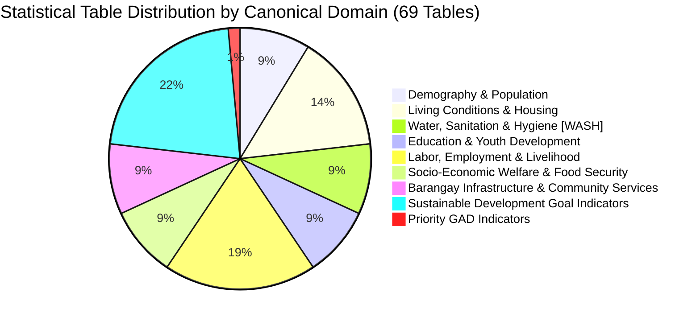

# TAGAD STATISTICAL TABLE CATALOG — 69 PSA CBMS TABLES
**System:** Talibon Analytics for Gender and Development (TAGAD)  
**Version:** `v2.0.0`  
**Source Baseline:** Official Philippine Statistics Authority (PSA) Community-Based Monitoring System (CBMS) Tabulation Plan  
**Status:** `[CANONICAL SPECIFICATION — 69 TABLES]`  
**Engineering Directive:** BUILD WHAT IS VERIFIED • VALIDATE WHAT IS IMPLEMENTED • DESIGN WHAT IS UNKNOWN • NEVER FABRICATE GOVERNMENT DATA  

---

## 1. Domain Taxonomy & Statistical Distribution

The 69 official PSA CBMS tables are organized into **9 Canonical Statistical Domains**:

---

## 2. Complete 69-Table Master Register & Verification Audit

| # | Code | Tab Name | Official PSA Table Title | Canonical Domain | Classification | Unit | Verification | Status |
| :-: | :--- | :--- | :--- | :--- | :--- | :--- | :-: | :-: |
| **1** | `STAT-TAB-01` | Summary statistics | Responding Households, Covered Population and Average Household Size | Demography & Population | Aggregated Statistics | Count / Avg | `[SOURCE-VERIFIED]` | `[READY]` |
| **2** | `STAT-TAB-02` | Households by size | Distribution of Households by Number of Household Members | Demography & Population | Aggregated Statistics | Households | `[SOURCE-VERIFIED]` | `[READY]` |
| **3** | `STAT-TAB-03` | Access to internet | Distribution of Households by Access to Internet | Barangay Infrastructure | Aggregated Statistics | Households | `[SOURCE-VERIFIED]` | `[READY]` |
| **4** | `STAT-TAB-04` | Perception on safety | Distribution of Respondents by Perception on Safety while Walking Alone in their Neighborhood at Night | Barangay Infrastructure | Aggregated Statistics | Respondents | `[SOURCE-VERIFIED]` | `[READY]` |
| **5** | `STAT-TAB-05` | Main source of water supply | Distribution of Households by Main Source of Water Supply | Water, Sanitation & Hygiene | Aggregated Statistics | Households | `[SOURCE-VERIFIED]` | `[READY]` |
| **6** | `STAT-TAB-06` | Main source of drinking water | Distribution of Households by Main Source of Drinking Water | Water, Sanitation & Hygiene | Aggregated Statistics | Households | `[SOURCE-VERIFIED]` | `[READY]` |
| **7** | `STAT-TAB-07` | Drinking water service level | Distribution of Households by Service Level of Drinking Water | Water, Sanitation & Hygiene | Indicator / Aggregates | Households / % | `[SOURCE-VERIFIED]` | `[READY]` |
| **8** | `STAT-TAB-08` | Toilet facility | Distribution of Households by Type of Toilet Facility | Water, Sanitation & Hygiene | Aggregated Statistics | Households | `[SOURCE-VERIFIED]` | `[READY]` |
| **9** | `STAT-TAB-09` | Toilet facility service level | Distribution of Households by Service Level of Toilet Facility | Water, Sanitation & Hygiene | Indicator / Aggregates | Households / % | `[SOURCE-VERIFIED]` | `[READY]` |
| **10** | `STAT-TAB-10` | Handwashing facility | Distribution of Households by Service Level of Handwashing Facility | Water, Sanitation & Hygiene | Indicator / Aggregates | Households / % | `[SOURCE-VERIFIED]` | `[READY]` |
| **11** | `STAT-TAB-11` | Building type | Distribution of Households by Type of Building/Housing Unit they Occupy | Living Conditions & Housing | Aggregated Statistics | Households | `[SOURCE-VERIFIED]` | `[READY]` |
| **12** | `STAT-TAB-12` | Roof material | Distribution of Households by Type of Material Used in the Roof of the Building they Occupy | Living Conditions & Housing | Aggregated Statistics | Households | `[SOURCE-VERIFIED]` | `[READY]` |
| **13** | `STAT-TAB-13` | Outer walls material | Distribution of Households by Type of Material Used in the Outer Walls of the Building/Housing Unit they Occupy | Living Conditions & Housing | Aggregated Statistics | Households | `[SOURCE-VERIFIED]` | `[READY]` |
| **14** | `STAT-TAB-14` | Floor material | Distribution of Households by Type of Material Used in the Floor of the Housing Unit they Occupy | Living Conditions & Housing | Aggregated Statistics | Households | `[SOURCE-VERIFIED]` | `[READY]` |
| **15** | `STAT-TAB-15` | Residence tenure status | Distribution of Households by Tenure Status of the Housing Unit and Lot they Occupy | Living Conditions & Housing | Aggregated Statistics | Households | `[SOURCE-VERIFIED]` | `[READY]` |
| **16** | `STAT-TAB-16` | Access to electricity | Distribution of Households by Availability of Electricity in the Building/Housing Unit they Occupy | Socio-Economic Welfare | Aggregated Statistics | Households | `[SOURCE-VERIFIED]` | `[READY]` |
| **17** | `STAT-TAB-17` | Fuel for cooking | Distribution of Households by Fuel/Energy Source Used for Cooking | Socio-Economic Welfare | Aggregated Statistics | Households | `[SOURCE-VERIFIED]` | `[READY]` |
| **18** | `STAT-TAB-18` | Access to secure tenure | Distribution of Households by Access to Secure Tenure | Living Conditions & Housing | Aggregated Statistics | Households | `[SOURCE-VERIFIED]` | `[READY]` |
| **19** | `STAT-TAB-19` | Overcrowding status | Distribution of Households by Overcrowding Status | Living Conditions & Housing | Aggregated Statistics | Households | `[SOURCE-VERIFIED]` | `[READY]` |
| **20** | `STAT-TAB-20` | Reliance on clean fuel | Distribution of Households by Reliance on Clean Fuels/Technology | Socio-Economic Welfare | Aggregated Statistics | Households | `[SOURCE-VERIFIED]` | `[READY]` |
| **21** | `STAT-TAB-21` | Food insecurity experience | Number of Households that Experienced Food Insecurity | Socio-Economic Welfare | Aggregated Statistics | Households | `[SOURCE-VERIFIED]` | `[READY]` |
| **22** | `STAT-TAB-22` | Financial account | Number of Households with Formal Financial Account by Type | Socio-Economic Welfare | Aggregated Statistics | Households | `[SOURCE-VERIFIED]` | `[READY]` |
| **23** | `STAT-TAB-23` | Medical treatment nonavailment | Number of Households with Member/s who got Ill/Sick/Injured but did not Avail Medical Treatment by Main Reason | Socio-Economic Welfare | Aggregated Statistics | Households | `[SOURCE-VERIFIED]` | `[READY]` |
| **24** | `STAT-TAB-24` | Population by sex | Distribution of Covered Population by Sex | Demography & Population | Aggregated Statistics | Persons | `[SOURCE-VERIFIED]` | `[READY]` |
| **25** | `STAT-TAB-25` | Population by age group | Distribution of Covered Population by Age Group and Sex | Demography & Population | Aggregated Statistics | Persons | `[SOURCE-VERIFIED]` | `[READY]` |
| **26** | `STAT-TAB-26` | Population by ethnicity | Distribution of Covered Population by Ethnicity | Demography & Population | Aggregated Statistics | Persons | `[SOURCE-VERIFIED]` | `[READY]` |
| **27** | `STAT-TAB-27` | Senior citizen ID | Distribution of Covered Population 60 Years Old and Over by Ownership of Senior Citizen ID | Demography & Population | Aggregated Statistics | Persons (60+) | `[SOURCE-VERIFIED]` | `[READY]` |
| **28** | `STAT-TAB-28` | Schooling status of 3-24yo | Distribution of Covered Population 3 to 24 Years Old by Schooling Status | Education & Youth | Aggregated Statistics | Persons (3-24) | `[SOURCE-VERIFIED]` | `[READY]` |
| **29** | `STAT-TAB-29` | Not schooling reason of 16-21yo | Distribution of Covered Population 16 to 21 Years Old who are not Attending School by Sex and Reason | Education & Youth | Aggregated Statistics | Persons (16-21) | `[SOURCE-VERIFIED]` | `[READY]` |
| **30** | `STAT-TAB-30` | Labor force participation (LFP) | Labor Force Participation Rate among Covered Population 15 Years Old and Over Excluding Overseas Filipino Workers | Labor & Employment | Indicator | Percent (%) | `[SOURCE-VERIFIED]` | `[READY]` |
| **31** | `STAT-TAB-31` | LFP by sex | Labor Force Participation Rate among Covered Population 15 Years Old and Over Excluding Overseas Filipino Workers by Sex | Labor & Employment | Indicator | Percent (%) | `[SOURCE-VERIFIED]` | `[READY]` |
| **32** | `STAT-TAB-32` | Key employment statistics | Employment, Unemployment and Underemployment among Covered Population 15 Years Old and Over Excluding Overseas Filipino Workers by Sex | Labor & Employment | Aggregated Statistics | Persons / % | `[SOURCE-VERIFIED]` | `[READY]` |
| **33** | `STAT-TAB-33` | Farmers and farm workers | Proportion of Farmers and Farm Workers among Covered Population 15 Years Old and Over Excluding Overseas Filipino Workers | Labor & Employment | Indicator | Percent (%) | `[SOURCE-VERIFIED]` | `[READY]` |
| **34** | `STAT-TAB-34` | Fisherfolk and fish workers | Proportion of Fisherfolk and Fish Workers among Covered Population 15 Years Old and Over Excluding Overseas Filipino Workers | Labor & Employment | Indicator | Percent (%) | `[SOURCE-VERIFIED]` | `[READY]` |
| **35** | `STAT-TAB-35` | Child labor | Distribution of Covered Population 5 to 17 Years Old by Engagement to Child Labor | Labor & Employment | Aggregated Statistics | Persons (5-17) | `[SOURCE-VERIFIED]` | `[READY]` |
| **36** | `STAT-TAB-36` | Working children by sex | Distribution of Working Children aged 5 to 17 Years Old by Sex | Labor & Employment | Aggregated Statistics | Persons (5-17) | `[SOURCE-VERIFIED]` | `[READY]` |
| **37** | `STAT-TAB-37` | Working children by occupation | Distribution of Working Children aged 5 to 17 Years Old by Occupation Group | Labor & Employment | Aggregated Statistics | Persons (5-17) | `[SOURCE-VERIFIED]` | `[READY]` |
| **38** | `STAT-TAB-38` | Employed managers | Distribution of Employed Persons in Managerial Positions by Sex | Labor & Employment | Aggregated Statistics | Persons | `[SOURCE-VERIFIED]` | `[READY]` |
| **39** | `STAT-TAB-39` | Class of workers | Distribution of Covered Population 15 Years Old and Over Excluding Overseas Filipino Workers who are Employed by Class of Worker | Labor & Employment | Aggregated Statistics | Persons (15+) | `[SOURCE-VERIFIED]` | `[READY]` |
| **40** | `STAT-TAB-40` | Industry group | Distribution of Covered Population 15 Years Old and Over Excluding Overseas Filipino Workers who are Employed by Industry Group | Labor & Employment | Aggregated Statistics | Persons (15+) | `[SOURCE-VERIFIED]` | `[READY]` |
| **41** | `STAT-TAB-41` | Youth engagement | Proportion of Youth not in Education, Employment or Training among Covered Population 15 to 24 Years Old | Education & Youth | Indicator | Percent (%) | `[SOURCE-VERIFIED]` | `[READY]` |
| **42** | `STAT-TAB-42` | SHS graduate not in school | Distribution of Senior High School Graduate not Attending School by Employment Status | Education & Youth | Aggregated Statistics | Persons | `[SOURCE-VERIFIED]` | `[READY]` |
| **43** | `STAT-TAB-43` | TVET graduate not in school | Distribution of Covered Population 15 Years Old and Over who are Technical and Vocational Education and Training Graduates not Attending School by Employment Status | Education & Youth | Aggregated Statistics | Persons (15+) | `[SOURCE-VERIFIED]` | `[READY]` |
| **44** | `STAT-TAB-44` | Manufacturing Industry | Proportion of Employed Individuals Engaged in the Manufacturing Industry | Labor & Employment | Indicator | Percent (%) | `[SOURCE-VERIFIED]` | `[READY]` |
| **45** | `STAT-TAB-45` | Informal employment | Proportion of Employed Individuals Who Are Self‑Employed and Unpaid Family Workers | Labor & Employment | Indicator | Percent (%) | `[SOURCE-VERIFIED]` | `[READY]` |
| **46** | `STAT-TAB-46` | Employed by occupation group | Distribution of Employed Persons by Occupation Group and by Sex | Labor & Employment | Aggregated Statistics | Persons | `[SOURCE-VERIFIED]` | `[READY]` |
| **47** | `STAT-TAB-47` | Public transportation | Distribution of Households by Access to Public Transportation | Barangay Infrastructure | Aggregated Statistics | Households | `[SOURCE-VERIFIED]` | `[READY]` |
| **48** | `STAT-TAB-48` | Working children not in school | Distribution of Working Children Aged 5 to 17 Years Old Who are Not in School by Age and Sex | Education & Youth | Aggregated Statistics | Persons (5-17) | `[SOURCE-VERIFIED]` | `[READY]` |
| **49** | `STAT-TAB-49` | Floor material strength | Distribution of Households by Strength of Floor Materials | Living Conditions & Housing | Aggregated Statistics | Households | `[SOURCE-VERIFIED]` | `[READY]` |
| **50** | `STAT-TAB-50` | Roof material strength | Distribution of Households by Strength of Roof Materials | Living Conditions & Housing | Aggregated Statistics | Households | `[SOURCE-VERIFIED]` | `[READY]` |
| **51** | `STAT-TAB-51` | Outer wall material strength | Distribution of Households by Strength of Outer Wall Materials | Living Conditions & Housing | Aggregated Statistics | Households | `[SOURCE-VERIFIED]` | `[READY]` |
| **52** | `STAT-TAB-52` | Waste collection | Availability of Garbage Collection Services by Barangay | Barangay Infrastructure | Aggregated Statistics | Barangays / HH | `[SOURCE-VERIFIED]` | `[READY]` |
| **53** | `STAT-TAB-53` | Network signal | Availability of Cellphone Network Signal by Barangay | Barangay Infrastructure | Aggregated Statistics | Barangays / Sig | `[SOURCE-VERIFIED]` | `[READY]` |
| **54** | `STAT-TAB-54` | DRRM | Presence of Disaster Risk Reduction and Management Measures by Barangay | Barangay Infrastructure | Aggregated Statistics | Barangays / Fac | `[SOURCE-VERIFIED]` | `[READY]` |
| **55** | `STAT-TAB-55` | SDG 1.4.1.3 | Proportion of Households with Access to Electricity | SDG Indicators | Indicator | Percent (%) | `[SOURCE-VERIFIED]` | `[READY]` |
| **56** | `STAT-TAB-56` | SDG 1.4.1.4 | Proportion of Households with Primary Reliance on Clean Fuels and Technology | SDG Indicators | Indicator | Percent (%) | `[SOURCE-VERIFIED]` | `[READY]` |
| **57** | `STAT-TAB-57` | SDG 1.4.1.5.p1 | Proportion of Households with Access to Basic Drinking Water Services | SDG Indicators | Indicator | Percent (%) | `[SOURCE-VERIFIED]` | `[READY]` |
| **58** | `STAT-TAB-58` | SDG 1.4.1.6.p1a | Proportion of Households with Access to Basic Sanitation Services | SDG Indicators | Indicator | Percent (%) | `[SOURCE-VERIFIED]` | `[READY]` |
| **59** | `STAT-TAB-59` | SDG 1.4.1.6.p1b | Proportion of Households with Access to Handwashing Facility with Soap and Water | SDG Indicators | Indicator | Percent (%) | `[SOURCE-VERIFIED]` | `[READY]` |
| **60** | `STAT-TAB-60` | SDG 1.4.2.p1 | Proportion of Households with Access to Secure Tenure | SDG Indicators | Indicator | Percent (%) | `[SOURCE-VERIFIED]` | `[READY]` |
| **61** | `STAT-TAB-61` | SDG 1.4.s4 | Proportion of Households with Owned or Owner-like Possession of Housing Units | SDG Indicators | Indicator | Percent (%) | `[SOURCE-VERIFIED]` | `[READY]` |
| **62** | `STAT-TAB-62` | SDG 5.5.2 | Proportion of Women in Managerial Positions | Priority GAD Indicators | Indicator | Percent (%) | `[SOURCE-VERIFIED]` | `[READY]` |
| **63** | `STAT-TAB-63` | SDG 8.3.1 | Proportion of Self-employed and Unpaid Family Workers | SDG Indicators | Indicator | Percent (%) | `[SOURCE-VERIFIED]` | `[READY]` |
| **64** | `STAT-TAB-64` | SDG 8.5.2 | Unemployment Rate | SDG Indicators | Indicator | Percent (%) | `[SOURCE-VERIFIED]` | `[READY]` |
| **65** | `STAT-TAB-65` | SDG 8.6.1 | Proportion of Youth (Aged 15-24 Years) Not in Education, Employment, or Training (NEET Rate) | SDG Indicators | Indicator | Percent (%) | `[SOURCE-VERIFIED]` | `[READY]` |
| **66** | `STAT-TAB-66` | SDG 8.7.1.p1 | Proportion of Children Aged 5–17 Years Engaged in Child Labour | SDG Indicators | Indicator | Percent (%) | `[SOURCE-VERIFIED]` | `[READY]` |
| **67** | `STAT-TAB-67` | SDG 9.2.2 | Manufacturing Employment as a Proportion of Total Employment | SDG Indicators | Indicator | Percent (%) | `[SOURCE-VERIFIED]` | `[READY]` |
| **69** | `STAT-TAB-69` | SDG 16.1.4.p1 | Proportion of Households that Feel Safe Walking Alone Around their Area at Night | SDG Indicators | Indicator | Percent (%) | `[SOURCE-VERIFIED]` | `[READY]` |
| **70** | `STAT-TAB-70` | SDG 17.8.1.p1 | Proportion of Households with Exposure to the Internet | SDG Indicators | Indicator | Percent (%) | `[SOURCE-VERIFIED]` | `[READY]` |
