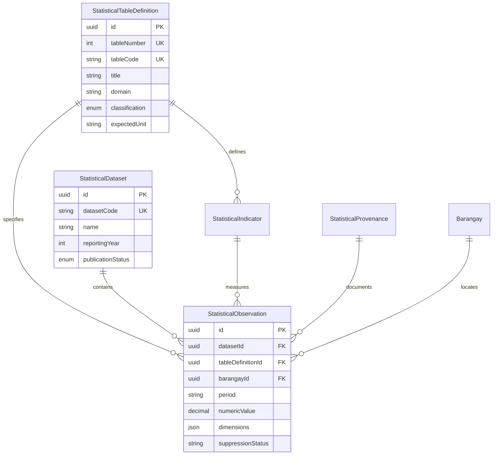

# TAGAD — Complete System Documentation & Engineering Overview

**System Name:** Talibon Analytics for Gender and Development (TAGAD)  
**Target Municipality:** Municipality of Talibon, Province of Bohol, Republic of the Philippines  
**Current System Baseline:** v2.0.0 (Modular Full-Stack Application, Express + React 19 / Vite + Prisma ORM)  
**Target Architecture:** Full-Stack Government Analytics, Ingestion Engine & Data Governance Platform  
**Documentation Status:** Authoritative System Specification based strictly on verified repository artifacts.

---

# 1. Executive Overview

### 1.1 Full System Name & Scope
**TAGAD** stands for **Talibon Analytics for Gender and Development**. It is an authoritative, dual-sided government data management, compliance tracking, and statistical analytics platform engineered for the Local Government Unit (LGU) of the Municipality of Talibon, Bohol.

### 1.2 The Problem It Solves
Historically, local government gender and development operations, municipal demographics, and beneficiary services operate in silos across disparate spreadsheets, paper records, and uncoordinated departmental repositories. This fragmentation leads to:
* **Duplicate and conflicting beneficiary records** across departments (e.g., MSWDO vs. MAO vs. Health Office vs. MPDC).
* **Severe friction in statutory compliance**, specifically regarding the mandatory minimum 5% Gender and Development (GAD) budget allocation, Harmonized Gender and Development Guidelines (HGDG) attribution, and national reporting to the Philippine Commission on Women (PCW), DILG, and DBM.
* **Loss of statistical provenance and structural fidelity** when handling official censuses and surveys, particularly the Philippine Statistics Authority (PSA) Community-Based Monitoring System (CBMS).
* **Significant risks of sensitive citizen data leakage**, directly violating the Philippine Data Privacy Act of 2012 (Republic Act No. 10173).

### 1.3 Why the System Exists
TAGAD establishes a centralized, verifiable municipal data clearinghouse. It provides authorized municipal officers with structured data entry, algorithmic CSV discovery and ingestion, multi-office data scoping, immutable audit logging, and automated GAD planning tools. Simultaneously, it exposes a sanitized, aggregated public portal for citizen transparency without leaking Personally Identifiable Information (PII).

### 1.4 Structured Government Data Platform vs. Mere Dashboard
TAGAD is explicitly **not** a cosmetic or mock visualization dashboard. It is an end-to-end data governance engine featuring:
* A typed relational schema governing operational and statistical domains.
* An intelligent transactional CSV ingestion engine with automated schema detection, column profiling, strict/tolerant validation rules, and deduplication strategies (`SKIP`, `UPDATE`, `APPEND`).
* A deterministic dataset lifecycle governance state machine (`DRAFT` $\to$ `VALIDATED` $\to$ `OFFICIAL` $\to$ `PUBLISHED` $\to$ `WITHDRAWN`).
* A canonical 69-table PSA CBMS metadata catalog spanning 9 official development domains.

### 1.5 Major System Domains Currently Present in Architecture
```
┌────────────────────────────────────────────────────────────────────────┐
│                        TAGAD CORE DOMAINS                              │
├────────────────────────────────┬───────────────────────────────────────┤
│ 1. Operational Domain          │ Beneficiary registry, household units,│
│                                │ GAD plans, programs, accomplishments  │
├────────────────────────────────┼───────────────────────────────────────┤
│ 2. Statistical Domain          │ 6 generic mother models, 69 PSA CBMS  │
│                                │ table catalog, macrodata observations │
├────────────────────────────────┼───────────────────────────────────────┤
│ 3. Reporting & Analytics       │ Sectoral demographics, budget vs.     │
│                                │ actuals, HGDG attribution scoring     │
├────────────────────────────────┼───────────────────────────────────────┤
│ 4. Administrative Management   │ User provisioning, office boundaries,  │
│                                │ 25 canonical barangay spatial anchors │
├────────────────────────────────┼───────────────────────────────────────┤
│ 5. Auditability & Traceability │ Immutable action logs, before/after   │
│                                │ JSON state diffs, source provenance   │
├────────────────────────────────┼───────────────────────────────────────┤
│ 6. Authentication & RBAC       │ Dual-token rotation (JWT + JTI),      │
│                                │ role guards, office boundary scoping  │
└────────────────────────────────┴───────────────────────────────────────┘
```

---

# 2. Purpose and Objectives

The primary engineering and operational objectives of TAGAD are:

* **Data Centralization (`IMPLEMENTED`)**: Consolidates municipal records into a single authoritative relational store, referencing Talibon's 25 constituent barangays and core executive offices.
* **Structured Government Data Management (`IMPLEMENTED`)**: Implements strongly typed data models for households, beneficiaries, programs, and GAD plan line items under strict validation constraints.
* **Gender and Development (GAD) Analytics (`IMPLEMENTED`)**: Automates calculations for statutory 5% GAD budget thresholds, quarterly physical/financial accomplishments, and HGDG gender responsiveness scoring.
* **Statistical Data Organization (`IMPLEMENTED`)**: Catalogs 69 official PSA CBMS statistical tabulations with domain classification, metric grain, and disaggregation specifications.
* **Administrative Data Ingestion (`IMPLEMENTED`)**: Provides operational CSV discovery and chunked transactional ingestion (250-row batches) with conflict resolution.
* **Controlled Access to Sensitive Information (`IMPLEMENTED`)**: Isolates raw citizen microdata from public endpoints via automatic deep PII sanitization.
* **Auditability & Traceability (`IMPLEMENTED`)**: Logs administrative mutations, batch imports, and dataset lifecycle transitions with actor references and timestamps.
* **Direct PSA CBMS Microdata Processing (`BLOCKED`)**: Full raw statistical matrix unpivoting is intentionally frozen pending acquisition of authentic PSA municipal microdata to avoid fabricating government statistics.

---

# 3. Target Users and Actors

### 3.1 Role-Based Access Control (RBAC) Hierarchy

The system defines four canonical roles in `prisma/schema.prisma` (`canonical_role`):

```text
[ SUPER_ADMIN ]  ──> System-wide administration, user management, public dataset release
       │
[    ADMIN    ]  ──> Cross-office review, dataset validation, officialization, GAD plan approval
       │
[   ENCODER   ]  ──> Department-scoped data entry, CSV upload, draft creation
       │
[   VIEWER    ]  ──> Read-only inspection of approved & official datasets
```

### 3.2 Municipal Office Scoping (`IMPLEMENTED`)
Operational accounts are bound to specific Local Government Offices via `officeId`:
* **MSWDO**: Municipal Social Welfare and Development Office (Solo parents, indigent families, 4Ps, PWDs, women in difficult circumstances).
* **MAO**: Municipal Agriculture Office (Farmers, fisherfolk, agricultural livelihood assistance).
* **MHO / RHU**: Municipal Health Office / Rural Health Unit (Maternal health, infant nutrition, sanitation).
* **MPDC**: Municipal Planning and Development Coordinator (CBMS statistical baseline consolidation, socioeconomic planning).
* **GFPS**: Gender and Development Focal Point System (Municipal-wide GAD planning, budget compliance, HGDG attribution).

### 3.3 System Role vs. Office Scope vs. Data Access

| Actor Context | System Role | Office Scope | Permitted Data Scope | Verified Workflow |
| :--- | :--- | :--- | :--- | :--- |
| **Municipal Mayor / Super Admin** | `SUPER_ADMIN` | Unrestricted (`null`) | All records, all offices, user accounts, audit logs | User creation, role reassignment, executive dataset publication to citizen portal. |
| **MPDC / GFPS Planning Officer** | `ADMIN` | Unrestricted (`null`) | Cross-office operational records, GAD plans, municipal statistics | GAD plan reviews, dataset validation (`DRAFT` $\to$ `VALIDATED`), officialization (`VALIDATED` $\to$ `OFFICIAL`). |
| **Departmental Data Encoder** | `ENCODER` | Department-bound (`officeId`) | Strictly restricted to assigned department's drafts and beneficiaries | CSV batch discovery, beneficiary data entry, draft dataset creation. Forbidden from viewing cross-office drafts. |
| **Observer / Auditor / Councilor** | `VIEWER` | Read-only | Approved programs, published accomplishments, official statistical tables | Inspection of aggregated reports and official datasets. Zero mutation access. |

---

# 4. High-Level System Architecture

### 4.1 Technology Baseline
* **Frontend Runtime:** React 19 (`react: ^19.0.1`, `react-dom: ^19.0.1`) with TypeScript 5.8.
* **Frontend Tooling:** Vite 6 (`vite: ^6.2.3`), Tailwind CSS v4 (`@tailwindcss/vite: ^4.1.14`), Lucide React.
* **Component Architecture:** Radix UI primitives (`@base-ui/react`), Lucide React icons, Sonner toast notifications, Recharts data visualizers.
* **Backend Runtime:** Node.js (v20+ LTS) running TypeScript via `tsx` dev runner and compiled via `esbuild` to CommonJS (`dist/server.cjs`).
* **API Framework:** Express 4 (`express: ^4.21.2`), CORS, Zod schema validation.
* **Database & ORM:** PostgreSQL accessed via Prisma ORM (`@prisma/client: 5.21.1`).
* **Infrastructure Target:** Supabase-managed PostgreSQL with Connection Pooling (`DATABASE_URL`) and Direct Migration endpoints (`DIRECT_URL`).
* **Security & Tokens:** JSON Web Tokens (`jsonwebtoken: ^9.0.3`) using HMAC-SHA256 with JTI revocation registries.

### 4.2 Logical Architecture Flow
```text
User
  ↓
Frontend Application (React 19, Vite, Tailwind CSS, Router v7)
  ↓
Backend API (Express Gateway on Port 3000)
  ↓
Authentication / Authorization (requireAuth, requireRole, requireOfficeScope)
  ↓
Application Services (BeneficiaryService, GADPlanService, CsvIngestionService, StatisticalDatasetService)
  ↓
Prisma ORM (Data-Access Layer & Query Engine)
  ↓
PostgreSQL / Supabase (Relational Database with Foreign Keys & Constraints)
```

---

# 5. Frontend / Backend Separation Strategy

### 5.1 Clear Boundary Definition

| Responsibility Layer | Frontend (`/src`) | Backend (`/server` and `server.ts`) |
| :--- | :--- | :--- |
| **Presentation & UX** | React component hierarchy, Tailwind styles, interactive tabs, modal workflows | Strictly headless JSON API; zero HTML templating |
| **Authentication State** | Token storage (`localStorage` / in-memory), React Context (`AuthContext`), navigation redirects | Authoritative credential verification (`bcrypt`), JWT generation, token verification, JTI revocation checks |
| **Authorization & RBAC** | UI route protection (`ProtectedRoute.tsx`), conditional button rendering | Authoritative middleware guards (`requireAuth`, `requireRole`, `requireOfficeScope`). Requests without credentials fail with `401`/`403`. |
| **Data Processing** | Visual table previews, column mapping interface, form field bindings | Schema detection, CSV column profiling, duplicate detection, chunked transactions, statistical matrix unpivoting |
| **Database Operations** | **Forbidden** from direct database access | Exclusive authority over Prisma ORM queries and transactions |

### 5.2 Repository Structure Status
* **Current Status:** **Logically separated within a unified monorepo / project structure (`IMPLEMENTED`)**.
* **Frontend Directory:** `/src` (Vite, React Router v7, UI modules).
* **Backend Directory:** `/server` (Controllers, Middleware, Services, Routes, Lib).
* **Shared Contract:** Managed via TypeScript interfaces in `/src/types` and `/server/services`.
* **Independent Deployment Readiness:** The backend is compiled to a standalone executable CommonJS bundle (`dist/server.cjs`) using `esbuild`, while the frontend compiles to static static assets (`dist/`) via `vite build`.

---

# 6. API Architecture and Security Boundary

### 6.1 Route Boundaries
The API strictly bifurcates into two top-level execution boundaries:

1. **Public Boundary (`/api/public/*`) — `IMPLEMENTED`:**
   * Requires no bearer tokens or authentication.
   * Deeply sanitized via `enforcePIISafety` middleware.
   * Restricts statistical data strictly to datasets marked with `publicationStatus = PUBLISHED`.
2. **Administrative Boundary (`/api/admin/*`) — `IMPLEMENTED`:**
   * Globally protected by `requireAuth`.
   * Sub-routes enforce granular roles (`SUPER_ADMIN`, `ADMIN`, `ENCODER`, `VIEWER`).
   * Enforces departmental office isolation.

### 6.2 Verified API Design Overview

| Route Boundary | Auth Requirement | Authorization Requirement | Expected Responsibilities | Validation & Security |
| :--- | :--- | :--- | :--- | :--- |
| `/api/public/*` | None (Public) | Publicly accessible | Expose aggregated municipal totals, approved plans, published datasets | Enforces deep PII stripping (`enforcePIISafety`); rate-limiting planned |
| `/api/admin/beneficiaries` | Bearer JWT | `SUPER_ADMIN`, `ADMIN`, `ENCODER` | CRUD operations on citizen microdata, household linking | Zod schema validation; `requireOfficeScope` blocks cross-office edits |
| `/api/admin/programs` | Bearer JWT | `SUPER_ADMIN`, `ADMIN`, `ENCODER` | Authoring and monitoring municipal intervention programs | Zod validation; status lifecycle enforcement |
| `/api/admin/gad-plans` | Bearer JWT | `SUPER_ADMIN`, `ADMIN`, `ENCODER` | Authoring annual GAD plans, budget line items, HGDG attribution | 5% budget statutory gate; office scoping; audit logging |
| `/api/admin/accomplishments`| Bearer JWT | `SUPER_ADMIN`, `ADMIN`, `ENCODER` | Tracking quarterly physical and financial accomplishments | MOV attachment tracking; variance justification checks |
| `/api/admin/ingestion` | Bearer JWT | `SUPER_ADMIN`, `ADMIN`, `ENCODER` | CSV discovery, heuristic mapping, chunked batch ingestion | Strict/tolerant mode validation; duplicate resolution strategies |
| `/api/admin/datasets` | Bearer JWT | `SUPER_ADMIN`, `ADMIN`, `ENCODER` | Statistical dataset registration and lifecycle state machine | Deterministic lifecycle state machine (`DRAFT` $\to$ `PUBLISHED`) |
| `/api/admin/users` | Bearer JWT | `SUPER_ADMIN`, `ADMIN` | User account provisioning and administrative assignment | Email uniqueness; role boundaries; password hashing |
| `/api/admin/audit-logs` | Bearer JWT | `SUPER_ADMIN`, `ADMIN` | Querying immutable system audit logs | Read-only access; actor and entity filtering |

---

# 7. Authentication Architecture

### 7.1 Lifecycle & Flow
```text
User
 ↓
Login (POST /api/auth/login with email/password)
 ↓
Credential verification (bcryptjs hash comparison against PostgreSQL/Prisma store)
 ↓
JWT issuance (Access Token 8h with JTI + Refresh Token 30d with SessionID)
 ↓
Authenticated requests (Authorization: Bearer <accessToken>)
 ↓
JWT verification (Signature & Expiration verification via HS256)
 ↓
JTI revocation check (Verification against in-memory blacklist Map)
 ↓
Role verification (requireRole guard checks role hierarchy)
 ↓
Authorized resource execution
```

### 7.2 Verified Security Mechanics
* **Authentication vs Authorization:** Authentication establishes identity via validated credentials and signed tokens; authorization checks role level and office boundaries before allowing action execution.
* **Token Rotation (`IMPLEMENTED`):** Refreshing a token generates a new JTI and revokes the predecessor JTI.
* **Logout / Revocation (`IMPLEMENTED`):** JTI revocation store (`tokenRevocationStore`) maintains invalidated token IDs with 15-minute garbage collection sweeps.
* **Production Validation Guard (`IMPLEMENTED`):** Server boot halts in production if secret keys are missing, short (<16 chars), or insecure defaults.

---

# 8. Authorization / RBAC Design

### 8.1 Authority Enforcement Matrix

| Functionality | `SUPER_ADMIN` | `ADMIN` | `ENCODER` | `VIEWER` | Verified Implementation |
| :--- | :---: | :---: | :---: | :---: | :--- |
| **System User Provisioning** | **YES** | **YES** | NO | NO | `requireRole(SUPER_ADMIN, ADMIN)` |
| **System Role Reassignment** | **YES** | NO | NO | NO | `requireRole(SUPER_ADMIN)` |
| **Cross-Office Data Mutate** | **YES** | **YES** | NO | NO | `requireOfficeScope()` |
| **Own-Office Data Mutate** | **YES** | **YES** | **YES** | NO | `requireOfficeScope()` |
| **CSV Batch Ingestion** | **YES** | **YES** | **YES** (Own Office) | NO | `requireRole(SUPER_ADMIN, ADMIN, ENCODER)` |
| **Dataset State: DRAFT $\to$ VALIDATED** | **YES** | **YES** | NO | NO | `StatisticalDatasetService.canTransition` |
| **Dataset State: VALIDATED $\to$ OFFICIAL** | **YES** | **YES** | NO | NO | `StatisticalDatasetService.canTransition` |
| **Dataset State: OFFICIAL $\to$ PUBLISHED** | **YES** | NO | NO | NO | `StatisticalDatasetService.canTransition` |
| **Dataset State: Any $\to$ WITHDRAWN** | **YES** | **YES** | NO | NO | Requires explicit reason string ($\ge 3$ chars) |
| **Read Approved / Published Data** | **YES** | **YES** | **YES** | **YES** | `requireAuth` |

---

# 9. Data Architecture

### 9.1 Operational Microdata Domain (`IMPLEMENTED`)
Governed by concrete Prisma models in `prisma/schema.prisma`:
* **`tagad_offices`**: Executive municipal departments (MSWDO, MAO, MHO, MPDC, GFPS).
* **`tagad_barangays`**: The 25 constituent barangays of Talibon acting as canonical spatial anchors.
* **`tagad_households`**: Household structures tracking poverty classifications (`is4Ps`, `isIndigent`).
* **`tagad_beneficiaries`**: Individual citizen microdata with sex, birthdate, civil status, sector, and household links.
* **`tagad_gad_plans`**: Annual GAD plans with 5% statutory threshold enforcement.
* **`tagad_gad_plan_items`**: Targeted interventions with HGDG gender attribution scores.
* **`tagad_programs`**: Operational municipal programs with sex-disaggregated target metrics.
* **`tagad_accomplishments`**: Physical output and financial disbursement tracking.
* **`tagad_mov_attachments`**: Means of Verification documents and files.

### 9.2 Statistical Macrodata Architecture & The Six Mother Models (`IMPLEMENTED`)

> **CRITICAL ARCHITECTURAL FACT:**  
> TAGAD contains an authoritative catalog of **69 PSA CBMS statistical table definitions**, but **69 separate physical database tables do NOT exist**.  
> Creating 69 rigid relational tables is an anti-pattern that causes schema bloat. Instead, TAGAD implements **6 generic "mother models"** capable of storing all 69 tabulations without schema migrations.



The six mother models are:
1. **`StatisticalTableDefinition` (`tagad_statistical_table_definitions`)**: Stores specification metadata for each of the 69 PSA tabulations.
2. **`StatisticalDataset` (`tagad_statistical_datasets`)**: Represents an imported survey round (e.g., "2024 Talibon CBMS").
3. **`StatisticalIndicator` (`tagad_statistical_indicators`)**: Formulae and numerator/denominator definitions.
4. **`StatisticalDimension` (`tagad_statistical_dimensions`)**: Standard disaggregations (Sex, Age Bracket, Industry).
5. **`StatisticalProvenance` (`tagad_statistical_provenance`)**: Lineage tracking (source file, checksum, uploading officer).
6. **`StatisticalObservation` (`tagad_statistical_observations`)**: Individual fact cell. Uses `Decimal(18,4)` for `numericValue`, references `barangayId` for spatial anchoring (or `NULL` for municipal totals), and indexes multidimensional combinations in a JSON field (`dimensions`).

---

# 10. Database Architecture

### 10.1 Relationship of Prisma, PostgreSQL, and Supabase
```text
Application (Node.js/Express)
     ↓
Prisma ORM (Query generation, migrations, connection management)
     ↓
PostgreSQL (Relational engine, transactional integrity, foreign keys)
     ↓
Supabase-managed PostgreSQL Infrastructure (Cloud hosting, pgBouncer pooling, storage)
```
* **Prisma ORM:** Acts as the data-access layer, compiling type-safe queries and validating transactions.
* **PostgreSQL:** Serves as the relational database engine executing atomic SQL transactions and enforcing schema constraints.
* **Supabase:** Provides managed cloud infrastructure for PostgreSQL, connection pooling (`DATABASE_URL`), direct DDL migration endpoints (`DIRECT_URL`), and object storage for MOV attachments.
* **Backend Autonomy:** All business logic, authorization rules, and CSV operations reside in the Node.js application layer.

---

# 11. Prisma Architecture

### 11.1 Schema Overview & Models
* **15 Prisma Models:** `Office`, `Barangay`, `Household`, `User`, `Beneficiary`, `GADPlan`, `GADPlanItem`, `Program`, `GADAccomplishment`, `MOVAttachment`, `AuditLog`, `StatisticalTableDefinition`, `StatisticalDataset`, `StatisticalIndicator`, `StatisticalDimension`, `StatisticalProvenance`, `StatisticalObservation`.
* **7 Enums:** `Role`, `Sex`, `GADPlanStatus`, `ProgramStatus`, `StatisticalTableClassification`, `StatisticalPublicationStatus`, `StatisticalVerificationStatus`.
* **Transaction Pattern:** Utilizes `prisma.$transaction` across 250-row chunk boundaries during batch ingestion.
* **Precision Handling:** Financial values are strictly mapped to `Decimal(14,2)`; statistical rates and counts are mapped to `Decimal(18,4)`.

---

# 12. Data Ingestion Architecture

### 12.1 Verified CSV Ingestion Pipeline
The operational ingestion pipeline implemented in `CsvDiscoveryService` and `CsvIngestionService` follows 8 distinct phases:

```text
CSV File Upload
  ↓
Discovery (Heuristic header matching against synonym registers)
  ↓
Schema Detection (Column type profiling, unique value counts, confidence scoring)
  ↓
Validation (Row-level evaluation against Sex, Date, and Barangay constraints)
  ↓
Mapping (Interactive source-to-target field association)
  ↓
Preview (Categorization into VALID, WARNING, ERROR, DUPLICATE)
  ↓
Duplicate Resolution (Human selection of SKIP, UPDATE, or APPEND)
  ↓
Transactional Ingestion (Execution in 250-row chunks using Prisma transactions)
  ↓
Audit Logging (Recording batch summary, actor ID, and row outcomes)
```

### 12.2 Conflict Resolution & Ingestion Modes
* **Duplicate Strategies:**
  * `SKIP`: Leaves existing records untouched; logs duplicate row indices.
  * `UPDATE`: Overwrites existing record fields with incoming CSV data.
  * `APPEND`: Creates a new record regardless of existing duplicates.
* **Ingestion Modes:**
  * `STRICT`: Halts execution and aborts the entire transaction if any row encounters a validation error.
  * `TOLERANT`: Skips malformed rows and commits valid rows, returning an error summary.

---

# 13. Statistical Data Ingestion Status

### 13.1 Intentional Engineering Freeze (`BLOCKED`)
While operational CSV ingestion for beneficiaries and programs is fully implemented, **the raw statistical matrix unpivoting engine for PSA CBMS data is intentionally frozen/blocked**.

### 13.2 Rationale
* **No Fabricated Government Data:** The system strictly prohibits synthesizing or generating artificial PSA CBMS household tabulations.
* **Raw Layout Dependency:** Official PSA statistical tables are delivered as complex multi-level cross-tabulations (e.g., merged headers, hierarchical row groupings, multi-line title banners). Writing an unpivoting parser without authentic source sample files risks silent data corruption.
* **Current Operational State:** The 69 table definitions are cataloged in `StatisticalCatalogService` and viewable via the Statistical Catalog UI (`/statistical-catalog`). However, batch ingestion of raw statistical survey files remains blocked until authentic PSA CBMS templates are provided by the local planning office.

> **Engineering Principle:**  
> *BUILD WHAT IS VERIFIED. VALIDATE WHAT IS IMPLEMENTED. DESIGN WHAT IS UNKNOWN. NEVER FABRICATE GOVERNMENT DATA.*

---

# 14. Data Lifecycle

```text
Source Data (CSV / Manual Form Entry)
 ↓
Upload & Discovery (Header analysis & schema matching)
 ↓
Validation (Type checking, foreign key resolution, format validation)
 ↓
Preview & Human Review (Review warnings, errors, and duplicates)
 ↓
Ingestion Execution (Chunked 250-row Prisma transactions)
 ↓
PostgreSQL Storage (Relational models & generic statistical observation cells)
 ↓
Audit Trail (Immutable log entry with before/after state diffs)
 ↓
Analytics & Reporting (Sectoral rollups, GAD accomplishment reports, public portal)
```

---

# 15. Data Integrity and Validation

* **Input Validation:** Enforced using Zod schemas on all API request bodies before reaching service methods.
* **Referential Integrity:** Operational data is strictly anchored to valid `barangay_id` records.
* **Statutory Financial Checks:** GAD plan validations verify that total allocated funds equal or exceed the statutory 5% minimum threshold of the municipal budget.
* **Transaction Boundaries:** Batch operations execute in atomic 250-row chunks; a fatal error rolls back the entire batch to prevent partial state corruption.
* **Database Constraints:** Composite unique constraints (such as `[officeId, fiscalYear]` on GAD plans) prevent duplicate submissions.

---

# 16. Audit and Traceability Architecture

### 16.1 Scope of Auditing (`IMPLEMENTED`)
Every state mutation across administrative models creates an entry in `tagad_audit_logs`:
* **User Identification:** Links directly to `tagad_users(id)` (with `onDelete: SetNull` to preserve history if a user account is deleted).
* **Action Types:** Captures operations including `CREATE`, `UPDATE`, `DELETE`, `LOGIN`, `INGEST_BATCH`, and `TRANSITION_STATUS`.
* **State Diff Tracking:** Stores complete JSON snapshots of `before_state` and `after_state`.
* **Client Context:** Records client IP address and user-agent string for forensic analysis.
* **Isolation:** Audit logs are append-only; no modification or deletion endpoints exist.

---

# 17. Security Architecture

### 17.1 Security Controls Inventory

| Control Area | Status | Technical Implementation |
| :--- | :--- | :--- |
| **Authentication** | **IMPLEMENTED** | JWT (HS256) with 8-hour access tokens and 30-day refresh tokens |
| **Token Invalidation** | **IMPLEMENTED** | In-memory JTI revocation registry with periodic garbage collection sweeps |
| **Production Boot Guard**| **IMPLEMENTED** | Halts server in production if secrets are missing, short (<16 chars), or default |
| **Authorization / RBAC** | **IMPLEMENTED** | `requireRole` middleware enforcing 4-tier role hierarchy |
| **Office Scope Isolation**| **IMPLEMENTED** | `requireOfficeScope` blocks cross-department mutations |
| **PII Data Leak Guard** | **IMPLEMENTED** | `enforcePIISafety` recursive sanitizer on all `/api/public/*` responses |
| **Input Validation** | **IMPLEMENTED** | Zod schema validation across all mutation controllers |
| **Password Storage** | **IMPLEMENTED** | One-way hashing via `bcryptjs` (salt rounds: 10) |
| **SQL Injection Defense** | **IMPLEMENTED** | Parameterized queries guaranteed by Prisma ORM |
| **Rate Limiting** | **PLANNED** | Express rate-limiting middleware not yet mounted |
| **Security Headers** | **PLANNED** | Helmet middleware (CSP, HSTS) not yet configured |

---

# 18. Public vs. Administrative Data

```text
PUBLIC CITIZEN INTERFACE (Zero Auth Required)
├── Aggregated Demographics (Counts by Barangay, Sector Percentages)
├── Approved GAD Plans (Total Budgets, Interventions)
├── Completed Program Accomplishments (General Statistics)
└── Published Statistical Datasets (isPublished = true only)
             ▲
             │ [ enforcePIISafety Middleware Interceptor ]
             │ Recursively strips: names, birthdates, contact numbers, street addresses, passwords
             │
ADMINISTRATIVE WORKSPACE (Bearer JWT + RBAC Required)
├── Individual Citizen Beneficiary Profiles
├── Unapproved / Draft GAD Plans & Budget Allocations
├── Means of Verification (MOV) Internal Documents
├── System User Accounts & Audit Trails
└── Draft / Validated / Official Internal Datasets
```

---

# 19. Reporting and Analytics Architecture

* **GAD Reports (`IMPLEMENTED`):** Automated compilation of annual GAD Plans and Accomplishment reports adhering to the official PCW-DILG-DBM Joint Circular format.
* **HGDG Budget Attribution (`IMPLEMENTED`):** Automated calculations of gender responsiveness attribution based on project HGDG scores:
  * Score $< 4.0$: 0% attribution (Gender Inherent/Inadmissible).
  * Score $4.0 - 7.9$: 25% attribution (Promising GAD prospect).
  * Score $8.0 - 14.9$: 50% attribution (Gender-sensitive).
  * Score $15.0 - 19.9$: 75% attribution (Gender-responsive).
  * Score $20.0$: 100% attribution (Fully gender-responsive).
* **Multi-Dimensional Statistical Cube (`PLANNED`):** Dynamic cross-tabulation across census rounds using observation dimensions.

---

# 20. Deployment Architecture

### 20.1 Physical Deployment Topology
```text
                         INTERNET
                            │
               ┌────────────┴────────────┐
               ▼                         ▼
      [ Public Citizen ]        [ Municipal Staff ]
               │                         │
               └────────────┬────────────┘
                            │ HTTPS
                            ▼
               ┌─────────────────────────┐
               │    NGINX Reverse Proxy  │
               │       (Port 3000)       │
               └────────────┬────────────┘
                            │
                            ▼
               ┌─────────────────────────┐
               │  Express Application    │
               │  - Static SPA Hosting   │
               │  - API Endpoints        │
               └────────────┬────────────┘
                            │
                            ▼
               ┌─────────────────────────┐
               │   PostgreSQL Engine     │
               │   (Supabase Managed)    │
               └─────────────────────────┘
```

### 20.2 Build and Start Pipeline
* **Build Phase:** Single unified command:
  ```bash
  npm run build
  # Executes: prisma generate && vite build && esbuild server.ts --bundle --platform=node --format=cjs --packages=external --sourcemap --outfile=dist/server.cjs
  ```
* **Production Start:**
  ```bash
  npm start
  # Executes: node dist/server.cjs
  ```

---

# 21. Environment and Secrets Management

### 21.1 Configuration Inventory (`.env.example`)
* `DATABASE_URL`: Connection-pooled PostgreSQL connection string for Prisma.
* `DIRECT_URL`: Non-pooled direct connection string for Prisma migrations.
* `JWT_SECRET`: High-entropy secret key for signing access tokens (min 16 chars).
* `JWT_REFRESH_SECRET`: High-entropy secret key for signing refresh tokens.
* `SUPABASE_URL`: Optional cloud project endpoint.
* `SUPABASE_SERVICE_ROLE_KEY`: Privileged backend key for Supabase operations.
* `VITE_SUPABASE_URL` / `VITE_SUPABASE_KEY`: Public client configurations.
* `APP_URL`: Canonical deployment domain.

> **CRITICAL SECURITY DIRECTIVE:**  
> Secrets and private credentials are never checked into version control. Production deployments inject environment variables through container runtime secret managers.

---

# 22. System Workflow: End-to-End Walkthrough

```text
1. DATA INGESTION
   MSWDO Staff logs in ──> Uploads "solo_parents_2024.csv" ──>
   Discovery Service detects 8 columns (Confidence: 94%) ──>
   Staff confirms mappings ──> Preview validates 250 rows ──>
   Execution inserts records inside Prisma transaction ──>
   Audit log recorded with batchId.

2. GAD PLANNING & BUDGETING
   GFPS Officer drafts 2025 GAD Plan ──>
   System checks 5% threshold ($2.5M of $50M general fund) ──>
   Interventions scored using HGDG matrix (Score: 16.5 -> 75% attribution) ──>
   Plan submitted for administrative approval.

3. STATISTICAL GOVERNANCE
   MPDC imports 2024 Demographic Summary ──> Dataset created as DRAFT ──>
   Planning Officer validates schema ──> Status: VALIDATED ──>
   Department Head reviews metrics ──> Status: OFFICIAL ──>
   Municipal Super Admin approves public release ──> Status: PUBLISHED.

4. CITIZEN TRANSPARENCY
   Citizen navigates to Public Portal ──>
   Views Municipal Demographics and published statistical tables ──>
   PII Sanitizer guarantees zero personal citizen identities are visible.
```

---

# 23. Current System Status

| Functional Area | Status | Repository Evidence |
| :--- | :--- | :--- |
| **Authentication & Tokens** | **IMPLEMENTED** | `server/lib/jwt.ts`, `server/services/AuthService.ts` |
| **RBAC Enforcement** | **IMPLEMENTED** | `server/middleware/authMiddleware.ts` |
| **Office Boundary Isolation** | **IMPLEMENTED** | `requireOfficeScope()` in `authMiddleware.ts` |
| **Public API & PII Stripping**| **IMPLEMENTED** | `server/routes/public.ts`, `server/middleware/piiSanitizer.ts` |
| **Administrative API** | **IMPLEMENTED** | `server/routes/admin/index.ts` |
| **Operational Models (9)** | **IMPLEMENTED** | `prisma/schema.prisma` (Beneficiary, Household, Program, GADPlan...) |
| **Statistical Mother Models (6)**| **IMPLEMENTED** | `prisma/schema.prisma` (Observation, TableDefinition, Dataset...) |
| **69 PSA Table Catalog** | **IMPLEMENTED** | `server/services/StatisticalCatalogService.ts` |
| **69 Physical SQL Tables** | **REJECTED BY DESIGN**| Documented anti-pattern; replaced by 6 mother models |
| **CSV Discovery Engine** | **IMPLEMENTED** | `server/services/CsvDiscoveryService.ts` |
| **CSV Ingestion (Chunked)** | **IMPLEMENTED** | `server/services/CsvIngestionService.ts` |
| **Statistical Dataset Governance**| **IMPLEMENTED** | `server/services/StatisticalDatasetService.ts` |
| **Statistical Matrix Ingestion**| **BLOCKED** | Intentionally frozen pending authentic PSA microdata |
| **Audit Logging System** | **IMPLEMENTED** | `server/services/AuditService.ts`, `tagad_audit_logs` |
| **Frontend Routing & UI** | **IMPLEMENTED** | `src/app/router/AppRouter.tsx`, `/src/pages/*` |
| **Automated Verification Tests**| **IMPLEMENTED** | `tests/datasetGovernance.test.ts`, `tests/statisticalCatalog.test.ts` (41 tests passing) |
| **Production Infrastructure** | **UNVERIFIED** | Requires verification against live Cloud Run / Supabase deployment |

---

# 24. Engineering Principles

1. **Never Fabricate Government Data:** Synthetic data must never be substituted for official census records or citizen registries.
2. **Verified Implementation Takes Precedence:** Code reflects current repository capabilities; planned features are explicitly marked.
3. **Strict Separation of Concerns:** Frontend renders UI; backend executes business logic and guards the database.
4. **Zero Client-Side Database Access:** No privileged database tokens are exposed to the browser.
5. **Architectural Restraint Over Schema Bloat:** Universal mother models are preferred over proliferating single-use physical tables.
6. **Immutable Traceability:** Every administrative mutation must generate an audit trail.
7. **Default to Privacy:** Citizen microdata is strictly confidential; public portals expose only aggregated macrodata.

---

# 25. Future Architecture Roadmap

* **Phase 1: Authentic Statistical Matrix Ingestion (`BLOCKED` $\to$ `PLANNED`)**
  * Ingest authentic PSA CBMS raw spreadsheets once obtained from the planning office.
  * Implement unpivoting parser converting multi-level Excel grids into `StatisticalObservation` records.
* **Phase 2: Advanced Geospatial Analytics (`PLANNED`)**
  * Integrate GeoJSON barangay boundary layers for choropleth mapping of poverty and demographic density.
* **Phase 3: Automated Agency Export Formats (`PLANNED`)**
  * One-click generation of official PCW GAD Plan and Accomplishment submission spreadsheets.
* **Phase 4: Production Hardening (`PLANNED`)**
  * Deployment of rate-limiting middleware, Redis-backed session stores, and automated database backups.

---

# 26. Glossary

* **TAGAD:** Talibon Analytics for Gender and Development.
* **CBMS:** Community-Based Monitoring System (national survey system established under RA 11315).
* **PSA:** Philippine Statistics Authority.
* **GAD:** Gender and Development.
* **GFPS:** Gender and Development Focal Point System.
* **HGDG:** Harmonized Gender and Development Guidelines.
* **PCW:** Philippine Commission on Women.
* **RBAC:** Role-Based Access Control.
* **JWT / JTI:** JSON Web Token / JWT ID (used for single-token revocation).
* **PII:** Personally Identifiable Information.
* **Mother Model:** A generalized database entity designed to store diverse multi-dimensional tabulations within a standardized structure.
* **Statistical Observation:** A single disaggregated fact cell (metric value, period, spatial anchor, dimension vector).

---

# 27. Final Architecture Summary

* **What TAGAD Is:** A centralized, dual-sided government analytics and data management platform built for the Municipality of Talibon, Bohol.
* **Who Uses It:** Municipal leadership, department heads, planning officers, encoders across 5 municipal offices, and the general public.
* **What Data It Manages:** Citizen beneficiary records, household poverty classifications, municipal GAD plans, budget expenditures, physical accomplishment reports, and 69 official PSA CBMS statistical tabulations.
* **How Data Enters:** Through authenticated data-entry forms or the 8-stage transactional CSV ingestion wizard with automated schema discovery and duplicate resolution.
* **How Data Is Validated:** Through Zod schemas at API boundaries, format and reference integrity checks in service layers, and atomic transactions in Prisma.
* **How Data Is Stored:** In a normalized PostgreSQL database (hosted via Supabase) featuring 9 operational models, 6 statistical mother models, and an immutable audit log table.
* **How Users Authenticate:** Via email and password verified with `bcryptjs`, issuing dual JWTs (8-hour access token, 30-day refresh token) with JTI revocation registries.
* **How Authorization Works:** Through Express middleware enforcing four hierarchical roles (`SUPER_ADMIN`, `ADMIN`, `ENCODER`, `VIEWER`) and departmental office isolation.
* **How Frontend and Backend Communicate:** Over HTTPS REST endpoints split into a public boundary (`/api/public/*`) and an authenticated administrative boundary (`/api/admin/*`).
* **Prisma & PostgreSQL:** Prisma acts as the type-safe query compiler and transactional executor interfacing with the PostgreSQL database.
* **Role of Supabase:** Provides managed PostgreSQL hosting, connection pooling, and asset storage.
* **Implemented Today:** Full operational domain, dual-token auth, office isolation, CSV discovery/ingestion wizard, 69-table metadata catalog, 6 statistical mother models, dataset lifecycle governance engine, PII-sanitized public portal, and full test suite.
* **Blocked / Planned:** Direct ingestion of raw PSA CBMS spreadsheet files remains intentionally frozen until authentic municipal survey data is provided.
